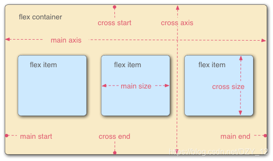
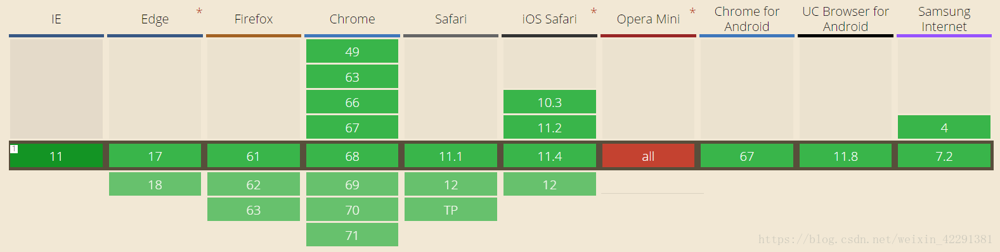
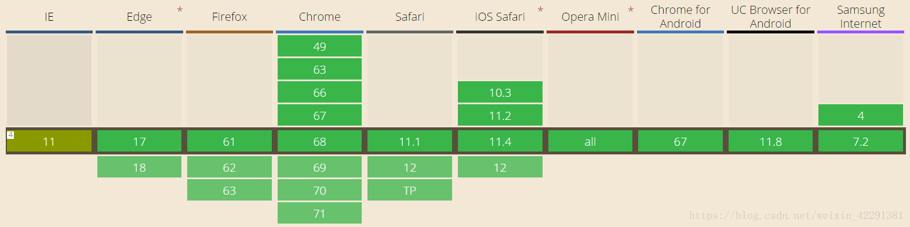
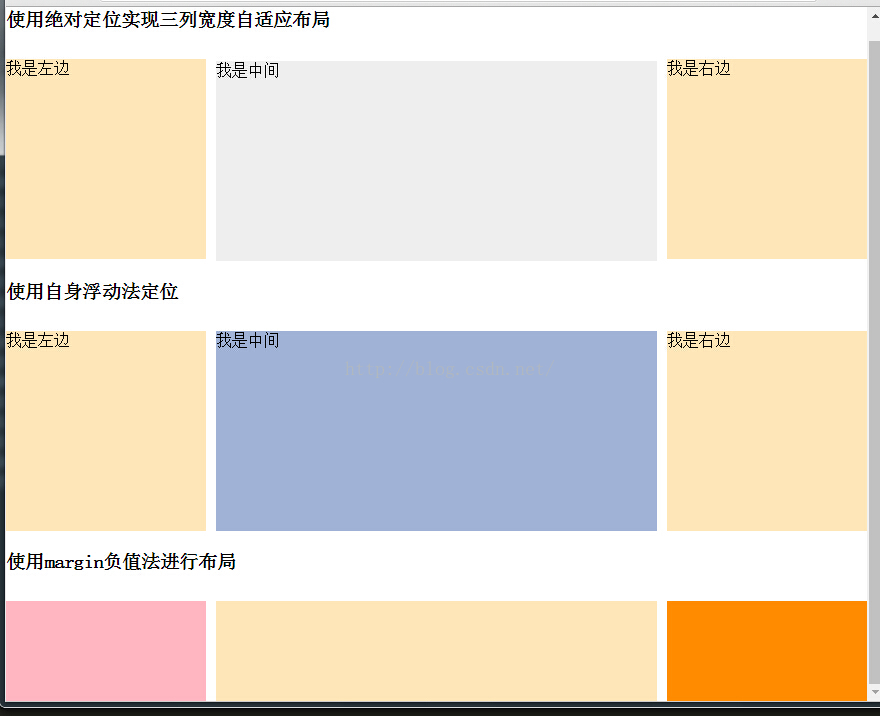
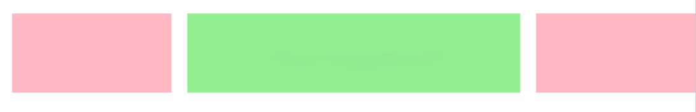

### 1.网络中使用最多的图片格式有哪些

JPEG、GIF、PNG以及最近网页常见的webp

------

### 2.请简述css盒子模型

CSS盒子模型也叫做框模型，具备内容(content)、填充(padding)、边框(border)、边界(margin)这些属性。在CSS中，每一个元素都被视为一个框，而每个框都有三个属性：

> border:元素的边框(可能不可见)，用于将框的边缘与其他框分开；
> margin：外边距，表示框的边缘与相邻框之间的距离，也称为页边空白；
> padding:内边距，表示框内容和边框之间的空间。

------

### 3.视频/音频标签的使用

(1)**视频video**
```html
<video
   src=”视频的路径”
   controls=”控制播放、暂停、音量等”
   autoplay=”自动播放”
   loop=”循环播放”
   width=”视频播放器的宽度”
   height=”视频播放器的高度”
</video>
```

还有做浏览器兼容的方式：


```html
          <video  controls autoplay loop width="500" height="500">
          <source src="video/hhxd.mp4" type="video/mp4"></source>
          <source src="video/ghsy.ogg" type="audio/ogg"></source>
     //flash支持
    //当所有不支持时，就提供一个下载路径。
    </video>
```

   (2)**音频audio**

```html
   <audio
      src=”音频的路径”
      controls=”控制播放、暂停、音量等”
      autoplay=”自动播放”
      loop=”循环播放”
   ></audio>
   //兼容类似视频方式
```

------

### 4.HTML5新增的内容有哪些

**语义化标签**：header，main，aside，nav，footer，section等

**增强型表单**：password number tel url file range color datatime date time week month 等

**新的表单属性**：placeholder list datalist min max autofocus等

**视频音频**：audio video

**Geolocation**：可以请求用户共享他们的位置

**Communication**：跨文档消息通信，可以确保iframe、标签页、窗口间安全地进行跨源通信。

**XMLHttpRequest Level2**：改进了跨源XMLHttpRequest和进度事件，XMLHttpRequest Level2通过CORS实现了跨源XMLHttpRequest。跨源HTTP请求包含一个Origin头部，它为服务器提供HTTP请求的源信息。

**WebSockets**：要连接远程主机，只需新建一个WebSocket实例，提供希望连接的对端URL。

**拖放API**：draggable属性、拖放事件(dragstart、drag、dragenter、dragleave、dragover、drap、dragend)、dataTransfer对象

**Web Workers API**：Web Workers可以让Web应用程序具备后台处理能力，对多线程的支持性非常好。但是在Web Workers中执行的脚本不能访问该页面的window对象，也就是Web Workers不能直接访问Web页面和DOM API。虽然Web Workers不会导致浏览器UI停止响应，但是仍然会消耗CPU周期，导致系统反应速度变慢。

**Web Storage API**：sessionStorage(保存在session中，浏览器关闭，数据消失)、localStorage(保存在客户端本地，除非手动删除，否则一直保存)

------

### 5.Html5 新增的语义化标签有哪些

**新的标签带来的是网页布局的改变及提升对搜索引擎的友好**

```html
<article> 定义文章 
<aside> 定义文章的侧边栏
<figure> 一组媒体对象以及文字 
<figcaption> 定义 figure 的标题
<footer>定义页脚 
<header>定义页眉
<hgroup>定义对网页标题的组合 
<nav>定义导航
<section> 定义文档中的区段 
<time>定义日期和时间
<dialog>定义一个对话框
<header></header>
<footer></footer>
<nav></nav>
<section> <section> 页面上的版块
用于划分页面上的不同区域,或者划分文章里不同的节
<article></ article > 
用来在页面中表示一套结构完整且独立的内容部分，可以用来呈现论坛的一个帖子，杂志或报纸中的一篇文章，一篇博客，用户提交的评论内容等。
<figure> 标签规定独立的流内容(图像、图表、照片、代码等等)。
<figcaption> figure的子元素 用于对figure的内容 进行说明
<time></time>
<datalist></datalist>选项列表。与 input 元素配合使用，来定义 input 可能的值。
<mark></mark> 需要标记的词或句子
<details></details>用于描述文档或文档某个部分的细节
< summary></summary> details 元素的标题
该元素用于摘录引用等 应该与页面的主要内容区分开的其他内容
Open 属性默认展开
```

**状态交互元素** 

```html
progress元素 ：标签定义运行中的进度(进程)
 <progress value="0" max="100"></progress> 
meter元素 ：标签定义度量衡。仅用于已知最大和最小值的度量。
 <meter value="70" max="100" min="0"></meter>
Forms
email  :  电子邮箱文本框，跟普通的没什么区别,当输入不是邮箱的时候，验证通不过.移动端的键盘会有变化
tel   :   电话号码,移动端的键盘
url   :   网页的URL
search  :  搜索引擎
range  :  特定范围内的数值选择器
min、max、step( 步数 )、value
用JS来显示当前数值
```

 **新的表单特性和函数**

```html
placeholder //输入框提示信息(密码框提示)
autocomplete //是否保存用户输入值默认为on，关闭提示选择off
autofocus //指定表单获取输入焦点
list和datalist //为输入框构造一个选择列表(list值为datalist标签的id)
required //此项必填，不能为空带有必填字段的表单
Pattern //正则验证  pattern="\d{1,5}“
formaction //在submit里定义提交地址
```

------

### 6.Css3新增的特性

**(1)新选择器**

>  E:nth-child(n) 选择器匹配其父元素的第n个子元素，不论元素类型，n可以使数字，关键字，或公式
>

>  E:nth-of-type(n) 选择与之其匹配的父元素的第N个子元素
>

> E:frist-child 相对于父级做参考，“所有”子元素的第一个子元素，并且“位置”要对应
>

> E：frist-of-type 相对于父级做参考，“特定类型”(E)的第一个子元素
>

> E：empty 选择没有子元素的每个E元素
>

> E:target 选择当前活动的E元素
>

> ::selection 选择被用户选取的元素部分
>

> 属性选择器
>
> E[abc*="def"] 选择adc属性值中包含子串"def"的所有元素

**(2)文本**

 **text-shadow**:2px 2px 8px #000;

参数1为向右的偏移量，参数2为向左的偏移量，参数3为渐变的像素，参数4为渐变的颜色

**text-overflow**:规定当文本溢出包含元素时发生的事情

**text-overflow**:ellipsis(省略)

**text-wrap**:规定文本换行的规则

**word-break** :规定非中日韩文本的换行规则

**word-wrap** :对长的不可分割的单词进行分割并换行到下一行

**white-space**: 规定如何处理元素中的空白  white-**space:nowrap** 规定段落中的文本不进行换行

**(3)边框**

**border-raduis**:50%边框的圆角

**border-image** 边框图片

```css
.border-image {
    border-image-source:url(images/border.png);
​    boder-image-slice:27;
​    border-image-width:10px;
​    border-iamge-repeat:round; 
//(round平铺)平铺效果不作用于四角,只适应与四边  
}
```

**(4)背景**

**rgba(0,0,0,0.3)**

**backgrounnd-size**:cover/contain

**background-size：cover**，会使“最大”边进行缩放，另一边同比缩放，铺满容器，超出部分会溢出。

**background-size:contain**，会使“最小”边进行缩放，另一边同比缩放，不一定铺满容器，会完整显示图片

**(5)渐变**

**linear-gradient()**:用于创建一个表示两种或多种颜色线性渐变的图片

background-image:linear-gradient(90deg,yellow 20%,green 80%)

渐变轴为90度，从黄色渐变到绿色

**radial-gradient()**:用径向渐变创建 "图像"

background-image:radial-gradient(120px at center center,yellow,green)

**(6)多列布局**

**column-count**:属性规定元素被分配列数

**column-width**:属性指定列的宽度

**column-gap**:列之间间隔

**column-rule**:列之间宽度样式和颜色规则，所有 column-rule-* 属性的简写

**(7)对象变换时的过渡效果transition**

**transition-property**:width       

**property**为定义过渡的css属性列表，列表以逗号分隔

**transition-duration**:2s;   过渡持续的时间

**transition-timing-function**:ease;  过渡的类型

**transition-delay**:5s;   延迟过渡的时间

**(8)动画、旋转**

**Animation动画特效**

**transform** ：translate(x,y) rotate(deg) scale(x,y)

**translate**:定义 2D 转换

**scale**:定义 2D 缩放转换

**rotate**:定义 2D 旋转，在参数中规定角度

**skew**(倾斜):定义沿着 X 和 Y 轴的 2D 倾斜转换

**(9)flex布局**

**(10)@media媒体查询**

------

### 7.清除浮动的方式有哪些？请说出各自的有特点

**(1)给父元素单独定义高度**
　　优点：简单快速、代码少。
　　缺点：无法进行响应式布局。

**(2)在标签结尾处加空div标签**

```html
<div style="clear: both"></div>
```

　　优点：简单快速、代码少，兼容性较高。
　　缺点：增加空标签，不利于页面优化。

**(3)父级定义overflow:hidden**
　　优点：简单快速、代码少，兼容性较高。
　　缺点：超出部分被隐藏了，在布局的时候要注意。

**(4)父级定义class="clearfix"，使用after伪类和zoom**

```css
.clearfix:after{
    content:"";
    display:block;
    clear:both;
    height:0;
    overflow:hidden;
    visibility:hidden;
}
.clearfix{
    zoom:1;
}
```

　　优点：写法固定，没有多余结构，兼容性高。
　　缺点：代码多。

------

### 8.定位的属性值有何区别

**两个方面的比较**

- 是否脱离文档流(标准流)
- 相对于谁定位

**比较**

1. **Position** 有四个属性值：relative absolute fixed static
2. **Relative** 相对定位 不脱离文档流，相对于自身定位
3. **Absolute** 绝对定位，脱离文档流 相对于父级定位
4. **Fixed** 固定定位，脱离文档流，相对于浏览器窗口定位
5. **Static** 默认值，元素出现在正常的流中

------

### 9.子元素如何在父元素中居中

**分成 块级元素 和 行内元素 进行总结**

**(1)块级元素**

①**flex布局**

  具体的做法就是把父元素的属性： jusity-content(主轴对齐方式) 和 align-items(交叉轴单行对齐) 的值设置为 center

②**绝对定位**

(position: absolute)+ 负margin(这种方式需要知道元素的宽高);

(position: absolute)+ transform: translate()属性。

**总结**： 

  其实后面两种原理是相同的，通过绝对定位设置top和left为50%之后，再考虑处理元素自身的宽高；区别是负margin的方式需要知道具体的值才能设置，而transform: translate()设置百分比就可以，不需要知道具体的值。

④**其他**

如果只需要水平居中：给对应的块级元素设置 margin: 0 auto; 即可

**(2)行内元素**

①在父元素上设置：text-align: center; 实现水平居中；设置元素的 line-height 的值等于父元素的 height 的值实现垂直居中，这应该是我们平时用的比较多的一种

②在父元素上设置：text-align: center; 实现水平居中；再给父元素设置 display: table; 行内元素设置 display: table-cell; vertical-align: middle; 实现垂直居中

③给行内元素一个没有宽高的父元素，利用 flex 布局使其父元素水平垂直居中即可

### 10.Border-box与content-box的区别

**⑴border-box**IE盒模型(怪异模式)

**width || height = content + padding + border**

> - 比如设定元素`width = 300px，padding = 20px，border=20px`，那么实际的内容区域宽度为`content = 300 - 20 * 2 - 20 * 2 = 220px`，整个盒子的宽度也就是它自己本身的`width = 300px`，也就是固定宽度后，如果增大border或者padding会压缩内容区的宽度；
> - **整个盒子实际宽度和高度**就是我们设置的盒子的宽度和高度，只是padding和border自动限制到div内，实际的**内容**区域宽度和高度自适应改变了，但总宽度、高度不变。
> - box-sizing:border-box是非常好用的样式属性，解脱了我们设置宽度和高度后再设置padding和border时重新计算设置宽度、高度的问题(因为我们可能需要保证整个盒子大小不变)。
> - 占的总的位置大小为：margin + width || height

**(2)content-box**W3C标准盒模型

**width || height = content 内容区域**

> - 比如设定元素`width = 300px，padding = 20px，border=20px`，那么实际的**内容**区域宽度为`content = 300px`；**整个盒子的宽度**为`300+20*2+20*2 = 380px`，也就是设定额外的padding或border会向外扩张元素的大小；
> - 占的总的位置大小为：margin + border + padding + width || height(width || height 为 content 内容区域 )
> - 即若想占的总的位置大小不变，增加padding就得较少width || height

**区别：**

**content-box 的 width 不包括 padding 和 border**

**border-box 的 width 包括 padding 和 border**

### 11.元素垂直居中

**分成 块级元素 和 行内元素 进行总结**

**(1)块级元素**

①**flex布局**

  具体的做法就是把父元素的属性：align-items(交叉轴单行对齐) 的值设置为 center

②**绝对定位**

(position: absolute)+ 负margin(这种方式需要知道元素的高);

(position: absolute)+ transform: translate()属性。

**总结**： 

  其实后面两种原理是相同的，通过绝对定位设置top为50%之后，再考虑处理元素自身的宽高；区别是负margin的方式需要知道具体的值才能设置，而transform: translate()设置百分比就可以，不需要知道具体的值。

④**其他**

如果只需要水平居中：给对应的块级元素设置 margin: 0 auto; 即可

**(2)行内元素**

①在父元素上设置：设置元素的 line-height 的值等于父元素的 height 的值实现垂直居中

②在父元素上设置：display: table; 

行内元素设置 display: table-cell; vertical-align: middle; 实现垂直居中

③给行内元素一个没有宽高的父元素，利用 flex 布局使其父元素水平垂直居中即可

### 12.如何让chrome浏览器显示小于12px的文字

 针对谷歌浏览器内核，加webkit前缀，用transform:scale()这个属性进行缩放！

```html
<style>
    p span{
        font-size:10px;
        -webkit-transform:scale(0.8);
        display:block;
    }
</style>
<p><span>测试10px</span></p>
```

### 13.Css选择器有哪些，那些属性可以继承，优先级如何计算？Css3新增的伪类有哪些

**CSS 选择符：**

1.id选择器(# myid)

2.类选择器(.myclassname)

3.标签选择器(div, h1, p)

4.相邻选择器(h1 + p)

5.子选择器(ul > li)

6.后代选择器(li a)

7.通配符选择器( * )

8.属性选择器(a[rel = "external"])

9.伪类选择器(a: hover, li:nth-child)

**可继承的样式：**

1.font-size

2.font-family

3.color

4.text-indent

**不可继承的样式：**

1.border

2.padding

3.margin

4.width

5.height

**优先级算法：**

1.优先级就近原则，同权重情况下样式定义最近者为准;

2.载入样式以最后载入的定位为准;

3.!important >  id > class > tag  

4.important 比 内联优先级高，但内联比 id 要高

**CSS3新增伪类举例：**

**p:first-of-type** 选择属于其父元素的首个p元素。

**p:last-of-type**  选择属于其父元素的最后 p元素。

**p:only-of-type**  选择属于其父元素唯一的子元素的每个p元素。

**p:only-child**   选择属于其父元素的唯一子元素的每个p元素。

**p:nth-child(2)**  选择属于其父元素的第二个子元素的每个p元素。

**:enabled**  选择启用的(常规)表单字段

**:disabled**选择禁用的表单字段(`disabled=true`)

**:checked** 选择已选中的表单字段(实际上只有复选框和单选按钮)。

### 14.网页中有大量图片加载很慢 你有什么办法进行优化？

1. 图片懒加载，滚动到相应位置才加载图片。原理是这个可以用js监控滚动的位置，当初图片位置出现或者即将出现在可视区域时，进行加载。
2. 图片预加载，如果为幻灯片、相册等，将当前展示图片的前一张和后一张优先下载。
3. 使用CSSsprite，SVGsprite，Iconfont、Base64等技术，如果图片为css图片的话。
4. 如果图片过大，可以使用特殊编码的图片，加载时会先加载一张压缩的特别厉害的缩略图，以提高用户体验。

------

### 15.行内元素/块级元素有哪些？

**(1)行内元素：**一个行内元素只占据它**对应标签的边框所包含的空间。**

<table>
    <tr>
        <td colspan="2"  style="text-align:center">行内元素</td>
    </tr>
    <tr>
        <td>a</td><td>锚点</td>
    </tr>
    <tr>
        <td>abbr</td><td>缩写</td>
    </tr>
    <tr>
        <td>acronym</td><td>首字</td>
    </tr>
    <tr>
        <td>b</td><td>粗体(不推荐)</td>
    </tr>
    <tr>
        <td>cite</td><td>引用</td>
    </tr>
    <tr>
        <td>br</td><td>换行</td>
    </tr>
    <tr>
        <td>em</td><td>强调</td>
    </tr>
    <tr>
        <td>font</td><td>字体设定(不推荐)</td>
    </tr>
    <tr>
        <td>i</td><td>斜体</td>
    </tr>
    <tr>
        <td>img</td><td>图片</td>
    </tr>
    <tr>
        <td>input</td><td>输入框</td>
    </tr>
    <tr>
        <td>label</td><td>表格标签</td>
    </tr>
    <tr>
        <td>span</td><td>常用内联容器，定义文本内区块</td>
    </tr>
    <tr>
        <td>strong</td><td>粗体强调</td>
    </tr>
    <tr>
        <td>sub</td><td>下标</td>
    </tr>
    <tr>
        <td>sup</td><td>上标</td>
    </tr>
    <tr>
        <td>textarea</td><td>多行文本输入框</td>
    </tr>
    <tr>
        <td>u</td><td>下划线</td>
    </tr>
</table>

**(2)块级元素：** **占据其父元素(容器)的整个空间**，因此创建了一个“块”。通常浏览器会在块级元素前后另起一个**新行**。 |

<table>
    <tr>
        <td colspan="2"  style="text-align:center">块级元素</td>
    </tr>
    <tr>
        <td>div</td><td>常用块级容器，也是CSS layout的主要标签</td>
    </tr>
    <tr>
        <td>dl</td><td>定义列表</td>
    </tr>
    <tr>
        <td>form</td><td>交互表单</td>
    </tr>
    <tr>
        <td>h1-h6</td><td>大、副、3、4、5、6标题</td>
    </tr>
    <tr>
        <td>hr</td><td>水平分隔线</td>
    </tr>
    <tr>
        <td>ol</td><td>有序表单</td>
    </tr>
    <tr>
        <td>p</td><td>段落</td>
    </tr>
    <tr>
        <td>table</td><td>表格</td>
    </tr>
    <tr>
        <td>ul</td><td>无序列表</td>
    </tr>
    <tr>
        <td>center</td><td>居中对齐块</td>
    </tr>
    <tr>
        <td>dir</td><td>目录列表</td>
    </tr>
    <tr>
        <td>fieldset</td><td>form控制组</td>
    </tr>
</table>

**空元素**：< hr/> < br/> < img/> < input/> < link/> < meta/>
< area>< base>< col>< command> < embed>< keygen>< param>< source>< track>< wbr>

------

### 16.浏览器的标准模式和怪异模式区别？

**标准模式：**是浏览器按照W3C标准解析执行代码，这样用规定的语法去渲染，就可以兼容各个浏览器，保证以正确的形式展示网页。
**怪异模式：**是使用浏览器自己的方式解析执行代码，因为不同浏览器解析执行的方式不一样，所以我们称之为怪异模式。这样的弊端就是网页在各个浏览器显示的效果不一样，很难统一。

------

### 17.Margin和padding在什么场合下使用

- margin是用来隔开元素与元素的间距，padding是用来隔开元素与内容的间隔。
- margin用来布局分开元素，使得元素与元素之间互不相干。
- padding用来布局元素与内容之间的间隔，让内容(文字)与(包裹)元素之间有一段空间。

**使用margin的场景：**
1.若需要在border外侧添加空白时。
2.空白处不需要背景(色)时。

注：上下相连的两个盒子之间的空白，需要相互抵消时。如15px + 20px的margin，将得到20px的空白。

**使用padding的场景：**
1.需要在border内测添加空白时。
2.空白处需要背景(色)时。

注：上下相连的两个盒子之间的空白，希望等于两者之和时。如15px + 20px的padding，将得到35px的空白。

**margin使用时应该注意：**

  margin在垂直方向上相邻的值相同时会发生叠加，水平方向上相邻的值会相加。margin取负值时，在垂直方向上，两个元素的边界仍然会重叠。但是，此时一个为正值，一个为负值，并不是取其中较大的值，而是用正边界减去负边界的绝对值，也就是说，把正的边界值和负的边界值相加。

------

### 18.弹性盒子布局属性有那些请简述?

**(1)主轴的方向**

```css
flex-direction: row | row-reverse | column | column-reverse;
row(默认值):主轴为水平方向,起点在左端。
row-reverse:主轴为水平方向,起点在右端。
column:主轴为垂直方向,起点在上沿。
column-reverse:主轴为垂直方向,起点在下沿。
```

**(2)换行属性**

```css
flex-wrap: nowrap | wrap | wrap-reverse;
nowrap://(默认)不换行。
wrap://换行,第一行在上方。
wrap-reverse://换行,第一行在下方。
//简写：方向 + 换行
flex-flow: <flex-direction> || <flex-wrap>;
```

**(3)主轴对齐方式**

```css
justify-content: flex-start | flex-end | center | space-between | space-around;
flex-start(默认值):左对齐
flex-end:右对齐
center: 居中
space-between:两端对齐,项目之间的间隔都相等。
space-around:每个项目两侧的间隔相等。所以,项目之间的间隔比项目与边框的间隔大一倍。
```

**(4)交叉轴对齐方式**

```css
align-items: flex-start | flex-end | center | baseline | stretch;
flex-start:交叉轴的起点对齐。
flex-end:交叉轴的终点对齐。
center:交叉轴的中点对齐。
baseline: 项目的第一行文字的基线对齐。
stretch(默认值):如果项目未设置高度或设为auto,将占满整个容器的高度。
```

**(5)多根轴线对齐方式**

```css
align-content: flex-start | flex-end | center | space-between | space-around | stretch;
flex-start:与交叉轴的起点对齐。
flex-end:与交叉轴的终点对齐。
center:与交叉轴的中点对齐。
space-between:与交叉轴两端对齐,轴线之间的间隔平均分布。
space-around:每根轴线两侧的间隔都相等。所以,轴线之间的间隔比轴线与边框的间隔大一倍。
stretch(默认值):轴线占满整个交叉轴。
```

**附：**

**项目属性** 

```css
order 定义项目的排列顺序。数值越小,排列越靠前,默认为0
flex-grow 定义项目的放大比例,默认为0,即不放大
flex-shrink 定义项目的缩放比例,默认为0,即不缩放
flex -basis 定义了在分配多余空间之前,项目占据的主轴空间
flex  flex-grow, flex-shrink 和 flex-basis的简写,默认值为0 1 auto
align-self  允许单个项目有与其他项目不一样的对齐方式
```

------

### 19.怎么实现标签的禁用

- `<input>` 标签的 disabled 属性
- 利用js的obj.setAttribute("disabled", "disabled");
- jQuery$(this).attr("disabled", "disabled");

### 20.Flex布局原理

**(1)是什么？**
Flex 是 Flexible Box 的缩写，意为"弹性布局"，是W3C 提出的一种新型布局方案，可以简便、完整、响应式地实现各种页面布局。目前，它已经得到了所有浏览器的支持。

顾名思义，弹性布局中的元素是有伸展和收缩自身的能力的。 相比于原来的布局方式，如float、position，根据盒子模型，就可以计算出元素的展示尺寸(长宽非百分比)，除非溢出，否则不依赖于父容器的大小。而弹性布局中元素的大小是高度依赖父容器的大小的。因为，它所具有的“伸缩性”，目标就是为了撑满父元素。当然也可以通过相关css属性控制其是否撑满、撑满什么轴。

**(2)原理**
采用 Flex 布局的元素，称为 Flex 容器(flex container)，简称"容器"。它的所有子元素自动成为容器成员，称为 Flex 项目(flex item)，简称"项目"

Flex 容器默认存在两根轴：水平的主轴(main axis)和垂直的交叉轴(cross axis)。项目默认沿主轴排列，当然项目的排列方向也可以通过改变属性来控制。

主轴的开始位置(与边框的交叉点)叫做main start，结束位置叫做main end；交叉轴的开始位置叫做cross start，结束位置叫做cross end。单个项目占据的主轴空间叫做main size，占据的交叉轴空间叫做cross size。



------

### 21.Px与rem的区别

**(1)PX**

px像素(Pixel)。相对长度单位。像素px是相对于显示器屏幕分辨率而言的。

**PX特点**

- IE无法调整那些使用px作为单位的字体大小；
- 国外的大部分网站能够调整的原因在于其使用了em或rem作为字体单位；
- Firefox能够调整px和em，rem，但是96%以上的中国网民使用IE浏览器(或内核)。

**(2)EM**

em是相对长度单位就是**根据基准来缩放字体的大小**。相对于当前对象内文本的字体尺寸。如当前对行内文本的字体尺寸未被人为设置，则相对于浏览器的默认字体尺寸。

**EM特点**

em的值并不是固定的；

em会继承父级元素的字体大小。

> **注意：**任意浏览器的默认字体高都是16px。所有未经调整的浏览器都符合: 1em=16px。那么12px=0.75em,10px=0.625em。为了简化font-size的换算，需要在css中的body选择器中声明Font-size=62.5%，这就使em值变为 16px*62.5%=10px, 这样12px=1.2em, 10px=1em, 也就是说只需要将你的原来的px数值除以10，然后换上em作为单位就行了。
>
> 所以我们在写CSS的时候，需要注意两点：
>
> 1. body选择器中声明font-size=62.5%；
> 2. 将你的原来的px数值除以10，然后换上em作为单位；
> 3. 重新计算那些被放大的字体的em数值。避免字体大小的重复声明。
>
> 也就是避免1.2 * 1.2= 1.44的现象。比如说你在#content中声明了字体大小为1.2em，那么在声明p的字体大小时就只能是1em，而不是1.2em, 因为此em非彼em，它因继承#content的字体高而变为了1em=12px。

**(3)REM**

rem是CSS3新增的一个相对单位(root em，根em)。这个单位与em区别在于使用rem为元素设定字体大小时，仍然是相对大小，但相对的只是HTML根元素。

**rem特点**

- rem 相对单位，相对于根元素 `<html>` ;
- 相对大小和绝对大小的优点于一身;
- 修改根元素就成比例地调整所有字体大小;
- 避免字体大小逐层复合的连锁反应.

目前，除了IE8及更早版本外，所有浏览器均已支持rem。对于不支持它的浏览器，应对方法也很简单，就是多写一个绝对单位的声明。这些浏览器会忽略用rem设定的字体大小。下面就是一个例子：

```css
p {font-size:14px; font-size:.875rem;}
```

> **注意：** *选择使用什么字体单位主要由你的项目来决定，如果你的用户群都使用最新版的浏览器，那推荐使用rem，如果要考虑兼容性，那就使用px,或者两者同时使用。*

**px 与 rem 的选择？**

对于只需要适配少部分手机设备，且分辨率对页面影响不大的，使用px即可 。

对于需要适配各种移动设备，使用rem，例如只需要适配iPhone和iPad等分辨率差别比较挺大的设备。

**rem 和 em 单位是由浏览器基于你的设计中的字体大小计算得到的像素值。**

| 二者比较 | em                                                           | rem                                                     |
| -------- | ------------------------------------------------------------ | ------------------------------------------------------- |
| 单位基于 | 基于使用他们的元素的字体大小                                 | 基于 html 元素的字体大小。                              |
| 继承     | 可能受任何继承的父元素字体大小影响                           | 可以从浏览器字体设置中继承字体大小。                    |
| 使用情况 | 使用em单位应根据组件的字体大小而不是根元素的字体大小。<br/>不使用em单位，并且需要根据浏览器的字体大小设置缩放的情况下使用rem。 | 使用rem单位，除非你确定你需要 em 单位，包括对字体大小。 |

> **注意：**
>
> - 媒体查询中使用 rem 单位。
> - 不要在多列布局中使用 em 或 rem ,改用%。
> - 不要使用 em 或 rem，如果缩放会不可避免地导致要打破布局元素。

### 22.网页的三层结构有哪些

- 构成：结构层、表示层、行为层
- 分别是：HTML、CSS、JavajScript
- 作用：HTML实现页面结构、CSS完成页面的表现与风格、JavaScript实现客户端的一些功能和业务

### 23.请简述媒体查询

**(1)什么是媒体查询以及响应式网站设计**

媒体查询就是通过查询当前属于哪种设备, 让网页能够在不同的设备下正常的预览。

**(2)如何在CSS文件中引入媒体查询**

媒体查询写在CSS样式代码的最后，CSS是层叠样式表，在同一特殊性下，靠后的的样式会 重叠前面的样式

```css
@media 设备类型 and (设备特征){
     div{width:200px;height:200px}
}
```

**(3)怎样使用media**

```css
Media所有参数汇总 
width:浏览器可视宽度。 
height:浏览器可视高度。 
device-width:设备屏幕的宽度。 
device-height:设备屏幕的高度。 
orientation:检测设备目前处于横向还是纵向状态。(landscape/portrait)
aspect-ratio:检测浏览器可视宽度和高度的比例。(例如：aspect-ratio:16/9)
device-aspect-ratio:检测设备的宽度和高度的比例。 
color:检测颜色的位数。(例如：min-color:32就会检测设备是否拥有32位颜色,向所有能显示颜色的设备应用样式表) 
color-index:检查设备颜色索引表中的颜色,他的值不能是负数。 
monochrome:检测单色楨缓冲区域中的每个像素的位数。(这个太高级,估计咱很少会用的到)
resolution:检测屏幕或打印机的分辨率。(例如：min-resolution:300dpi或min-resolution:118dpcm)。 
grid:检测输出的设备是网格的还是位图设备,如果设备是基于网格的(例如电传打字机终端或只能显示一种字形的电话),该值为1,否则为0
```

**步骤:**

**1)首先需要在html文档中添加以下代码，用来兼容移动设备的显示效果**

```html
<meta name="viewport" content="width=device-width, initial-scale=1.0, minimum-scale=1.0, 
maximum-scale=1.0, user-scalable=no"> 是否允许屏幕缩放

    width=device-width:宽度等于当前设备的宽度 
    initial-scale=1：初始的缩放比例(默认为1) 
    maximum-scale=1：允许用户缩放到得最大比例(默认为1) 
    user-scalable=no：用户不能手动缩放
```

**2)怎样在CSS文件中写CSS响应式媒体查询**

```css
@media screen and (max-width:720px) and (min-width:320px){ 
    body{ 
        background-color:red; 
    } 
}
@media screen and (max-width:320px){ 
    body{ 
        background-color:blue; 
    } 
}
```

------

### 24.Rem缺点

1. 在奇葩的 dpr 设备上表现效果不太好，比如一些华为的高端机型用 rem 布局会出现错乱。
2. 使用 iframe 引用也会出现问题。
3. rem 在多屏幕尺寸适配上与当前两大平台的设计哲学不一致。即大屏的出现到底是为了看得又大又清楚，还是为了看的更多的问题。

------

### 25.常见的兼容性

> 不同浏览器的内核不尽相同，所以各个浏览器对网页的解析存在一定的差异。
> 浏览器内核主要分为两种，一是渲染引擎，另一个是js 引擎
> 所以浏览器兼容性问题一般指：css兼容、js兼容

**(1)css兼容**
*<1>不同浏览器的标签默认的margin和padding不同*

**问题症状：** 随便写几个标签，不加样式控制的情况下，各自的margin 和padding差异较大。

**碰到频率: **100%

**解决方案：**
CSS里 `*{margin:0;padding:0;}` 但是性能不好
一般我们会引入`reset.css`样式重置

**备注：** 这个是最常见的也是最易解决的一个浏览器兼容性问题，所有的CSS文件开头都会用样式重置各个标签的内外补丁是0。

*<2>css3新属性，加浏览器前缀兼容早期浏览器*

> `-moz-`  火狐浏览器 
> `-webkit-` Safari, 谷歌浏览器等使用Webkit引擎的浏览器 
> `-o-` Opera浏览器(早期) 
> `-ms-` IE 

**哪些css3属性需要加：**

```css
@keyframes  定义关键帧动画
css3中的变形(transform)、过渡(transtion)、动画(animation)
border-radius 圆角
box-shadow  盒子阴影
flex  弹性布局
```

**使用：**

```css
.myClass {
	-webkit-animation-name: fadeIn;
	animation-name: fadeIn;  /* 不带前缀的放到最后 */
}
/* 复杂属性 keyframes */
@-webkit-keyframes fadeIn {
	0% { opacity: 0; } 100% { opacity: 0; }
}
@keyframes fadeIn {
	0% { opacity: 0; } 100% { opacity: 0; }
}/* 不带前缀的放到最后 */
```


**(2)js兼容**

**<1>事件绑定**

**IE:** `dom.attachEvent();`
标准浏览器： `dom.addEventListener(‘click',function(event){},false);`

标准浏览器采用事件捕获的方式对应IE的事件冒泡机制(即标准由最外元素至最内元素或者IE由最内元素到最外元素)最后标准方亦觉得IE这方面的比较合理，所以便将事件冒泡纳入了标准，这也是`addEventListener`第三个参数的由来，而且事件冒泡作为了默认值第三值默认false，表示事件冒泡方式。

如果浏览器不支持 `addEventListener()`方法, 你可以使用 attachEvent()方法替代。

以下实例演示了跨浏览器的解决方法：

```javascript
var x = document.getElementById("myBtn");
if (x.addEventListener) {   //所有主流浏览器，ie9+
    x.addEventListener("click", myFunction);
} else if (x.attachEvent) {      // IE 8 及更早 IE 版本
    x.attachEvent("onclick", myFunction);
}
```

**<2>event事件对象问题**

```javascript
document.onclick=function(ev){//谷歌火狐的写法，IE9以上支持，往下不支持；
        var e=ev;
        console.log(e);
    }
    document.onclick=function(){//谷歌和IE支持，火狐不支持；
        var e=event;
        console.log(e);
    }
    document.onclick=function(ev){//兼容写法；
        var e=ev||window.event;
        var mouseX=e.clientX;//鼠标X轴的坐标
        var mouseY=e.clientY;//鼠标Y轴的坐标
    }
```

**<3>event.srcElement(事件源对象)问题**

**IE：** `event`对象有`srcElement`属性，但是没有`target`属性；
**Firefox:** `event`对象有`target`属性，但是没有`srcElement`属性。
**解决方法**：

```javascript
srcObj = event.srcElement?event.srcElement:event.target;
```

**<4>获取元素的非行间样式值**：
**IE**: `dom.currentStyle['width']` 获取元素高度
**标准浏览器**：`window.getComputedStyle(obj, null)['width']`;

**跨浏览器兼容解决方法：**

```javascript
// 获取元素属性值的兼容写法
  function getStyle(obj,attr){
      if(obj.currentStyle){
         //兼容IE
 　　　　　　obj.currentStyle[attr];
          return obj.currentStyle[attr];
      }else{
         //非IE，
 　　　　return window.getComputedStyle(obj, null)[attr]; 
 　    }
 　 }
```

**<5>阻止事件冒泡传播：**

```javascript
//js阻止事件传播，这里使用click事件为例
    document.onclick=function(e){
        var e=e||window.event;
        if (e.stopPropagation) {
            e.stopPropagation();//W3C标准
        }else{
            e.cancelBubble=true;//IE....
        }
    }
```

**<6>阻止事件默认行为：**

```javascript
//js阻止默认事件   一般阻止a链接href，form表单submit提交
    document.onclick=function(e){
        var e=e||window.event;
        if (e.preventDefault) {
            e.preventDefault();//W3C标准
        }else{
            e.returnValue='false';//IE..
        }
    }
```

**<7>ajax兼容问题**
**IE：** `ActiveXObject`
**其他：** `xmlHttpRequest`

> 在IE6以前不是用XMLHttpRequest创建的，所以我们要兼容ie6以前的浏览器要判断他有没有XMLHttpRequest()

跨浏览器兼容解决方法：

```javascript
<script>
	window.onload = function(){
		var oBtn = document.getElementById('btn');
		oBtn.onclick = function(){
			//1.创建ajax对象
			//只支持非IE6浏览器
			var oAjax = null;
			if(window.XMLHttpRequest){
				oAjax = new XMLHttpRequest();				
				//alert(new XMLHttpRequest());
			}else{
				//只支持IE6浏览器
				oAjax = new ActiveXObject("Microsoft.XMLHTTP");	
			}
			//2.连接服务器,这里加个时间参数,每次访问地址都不一样,浏览器就不用浏览器里的缓冲了,但
			//	但服务器那端是不解析这个时间的
			oAjax.open("get","a.txt?t=" + new Date().getTime(),true);
			//3.发送
			oAjax.send(null);		
			//4.接受信息
			oAjax.onreadystatechange = function(){
				//浏览器与服务器之间的交互,进行到哪一步了,当等于4的时候,代表读取完成了
				if(oAjax.readyState==4){
					//状态码,只有等于200,代表接受完成,并且成功了
					if(oAjax.status==200){
						alert("成功" + oAjax.responseText);	
					}else{
						alert("失败");	
					}	
				}	
			};
				
		};
	};
</script>
```

------

### 26.垂直与水平居中的方式

**(1)固定宽高：**

**<1>margin**

根据已知的宽高写死，不推荐

**<2>定位 + margin反向偏移**

```css
.box-container{
	    position: relative;
        width: 300px;
	    height: 300px;
	}
.box-container .box {
	    width: 200px; 
	    height: 100px;
	    position: absolute; 
	    left: 50%; 
	    top: 50%;
	    margin-top: -50px;    /* 高度的一半 */
	    margin-left: -100px;    /* 宽度的一半 */
	}
```

设置父元素的position为相对定位，子元素绝对定位，并在 top 和 left 方向上移动父元素50%的距离。

但这个时候，是子元素的**上边框**和**左边框**距离父元素150px，整体向右下角偏了一些，所以还需要再用 margin 调整至中心位置，数值分别是高度和宽度的一半。

**<3>绝对定位 + margin:auto**

```css
.box-container{
        position: relative;
    }
.box {
        width: 100px;
        height: 100px;
        position: absolute; 
        left: 0; 
        top: 0; 
        right: 0; 
        bottom: 0;
        margin: auto;
    }
```

同样是使用绝对定位，但四个方向的偏移量全都为0，之后设置 margin:auto 分配剩余空间，令元素的均匀拖拽至父元素的中心位置。

**(2)未知宽高**

**<1>绝对定位+transform反向偏移: 存在兼容问题：**

```css
.box {
        position: relative; 
        left: 50%; 
        top: 50%;
        transform: translate(-50%, -50%);    
    }
```

在**子元素**上设置，`transform: translate(-50%, -50%);`  用于平面的2D转换，后面的百分比以自身的宽高为参考，定位后将元素的左上角置于父级中央，之后再用 transform 进行偏移，相当于上面设置的 `margin-top` 和 `margin-left`。

注意：`transform`存在浏览器兼容问题，如下表。



**<2>flexbox 方案: 存在兼容问题**

```css
.box-container {
        display: -webkit-flex;
        display: -moz-flex;
        display: -ms-flex;
        display: -o-flex;
        display: flex;
        justify-content: center;
        align-items: center;
    }
```

设置**父元素**为 flex 弹性盒模型，并在主轴和副轴上设置居中，关于弹性盒模型的详情[请点击这里](http://www.ruanyifeng.com/blog/2015/07/flex-grammar.html)。

作为新增属性，flex同样存在兼容问题，如下表：



**<3>display: table-cell 无兼容性问题**

```css
.box {
		position: relative;
		width: 300px;
		height: 300px;
		border: 1px solid red;
		display: table-cell;	
		text-align: center;	
		vertical-align: middle;
	}
```

只需要设置**父元素**即可，`text-align: center;` 并在竖直方向上令内容居中(middle)，早期属性，不存在兼容问题。

------

### 27.三栏布局方式两边固定中间自适应

> 分为两大类，一类是基于position传统的实现，一类是基于css3新特性弹性盒模型布局实现。

**(1)基于传统的position和margin等属性进行布局**

**<1>绝对定位法**

 **绝对定位法原理**是将左右两边使用absolute定位，因为绝对定位使其脱离文档流，后面的center会自然流动到他们上面，然后使用margin属性，留出左右元素的宽度，既可以使中间元素自适应屏幕宽度。

代码如下：

```html
<!DOCTYPE html>
<html>
    <head>
        <meta charset="UTF-8">
        <title>layout_box</title>
        <style>
            html,body{
                margin: 0px;width: 100%;
            }  
 			h3{
    			height: 100px;
    			margin:20px 0 0;
            }  
			#left,#right{
   				width: 200px;
    			height: 200px; 
    			background-color: #ffe6b8;
    			position: absolute;
    			top:120px;
            }  
			#left{
    			left:0px;
			}  
			#right{
    			right: 0px;
            }  
			#center{
   				margin:2px 210px;
    			background-color: #eee;
    			height: 200px; 
            } 
        </style>
    </head>
    <body>
        <h3>实现三列宽度自适应布局</h3>
        <div id = "left">我是左边</div>
        <div id = "right">我是右边</div>
        <div id = "center">我是中间</div>
    </body>
</html>
```

> 该法布局的**好处**，三个div顺序可以任意改变。
>
> **不足**是因为绝对定位，所以如果页面上还有其他内容，top的值需要小心处理，最好能够对css样式进行一个初始化，就像在上面例子中加了一个标题，如果不对样式进行初始化，则两边和中间的值会对不齐。 另外，随着浏览器窗口缩小，小于200px的时候，会发生压缩。
>
> 结果如图，可以看到**中间栏宽度随着屏幕大小伸缩。**

**<2>使用自身浮动法**

**自身浮动法的原理**就是使用对左右使用分别使用float:left和float:right，float使左右两个元素脱离文档流，中间元素正常在正常文档流中，使用margin指定左右外边距对其进行一个定位。

```html
<!DOCTYPE html>
<html>
    <head>
        <meta charset="UTF-8">
        <title>layout_box</title>
        <style>
            #left_self,#right_self{
                width: 200px;
                height: 200px; 
                background-color: #ffe6b8 
            }  
			#left_self {
   				float: left;
            }  
			#right_self{
    		float: right;
            }  
			#center_self{
                margin: 0 210px;
                height: 200px; 
                background-color: #a0b3d6
            } 
        </style>
    </head>
    <body>
        <h3>使用自身浮动法定位</h3>
		<div id = "left_self">我是左边</div>
		<div id = "right_self">我是右边</div>
		<div id = "center_self">我是中间</div>
    </body>
</html>
```

> 该布局法的**好处**是受外界影响小。
>
> **不足**是三个元素的顺序，center一定要放在最后，这是和绝对定位不一样的地方，center占据文档流位置，所以一定要放在最后，左右两个元素位置没有关系。当浏览器窗口很小的时候，右边元素会被击倒下一行。

**<3>圣杯布局**

**圣杯布局的原理**是margin负值法。使用圣杯布局首先需要在center元素外部包含一个div，包含div需要设置float属性使其形成一个BFC，并设置宽度，并且这个宽度要和left块的margin负值进行配合。

```html
<!DOCTYPE html>
<html>
    <head>
        <meta charset="UTF-8">
        <title>layout_box</title>
        <style>
            #wrap{ 
                width: 100%;
                height: 100px; 
                background-color: #fff;
                float: left;
            }  
			#wrap #center{ 
                margin:0 210px; 
                height: 100px;
                background-color: #ffe6b8; 
            }  
			#left_margin,#right_margin{ 
                float: left;
                width: 200px;
                height: 100px;
                background-color: darkorange 
            }  
			#left_margin {
                margin-left: -100%; 
                background-color: lightpink;
            }  
			#right_margin{
                margin-left: -200px;
            } 
        </style>
    </head>
    <body>
        <h3>使用margin负值法进行布局</h3>
        <div id = "wrap">
            <div id = "center"></div>
        </div>
        <div id = "left_margin"></div>
        <div id = "right_margin"></div>
    </body>
</html>
```

> 该方法在网站布局中非常常见，也是面试常考点，**优点**是三栏相互关联，有一定的抗性。需要**注意**的是，布局中间部分一定要放在前面，左右顺序不限制。对于left快的margin负值一定要等于wrap的宽度。

三种方法实现三栏网页宽度自适应布局方法见下图。



**(2)css3新特性**

在外围包裹一层div，设置为display：flex；中间设置flex：1；但是盒模型默认紧紧挨着，可以使用margin控制外边距。

```html
<!DOCTYPE html>
<html>
    <head>
        <meta charset="UTF-8">
        <title>layout_box</title>
        <style>
            #box{
                width:100%;
                display: flex; 
                height: 100px;
                margin: 10px;
            }  
			#left_box,#right_box{
                width: 200px;
                height: 100px; 
                margin: 10px; 
                background-color: lightpink;
            }  
			#center_box{ 
                flex:1; 
                height: 100px;
                margin: 10px; 
                background-color: lightgreen;
            }
        </style>
    </head>
    <body>
        <div id = "box">
         <div id = "left_box"></div>
         <div id = "center_box"></div>
         <div id = "right_box"></div>
        </div>
    </body>
</html>
```

**注意： center一定要放到中间。**

效果图如下：



------

### 28.Doctype作用

1. `<!Doctype>`声明位于文档中的最前面，处于`<html>`标签之前。告知浏览器的解析器，用什么文档类型规范来解析这个文档。
2. 严格模式的排版和js运作模式是以该浏览器支持的最高标准运行。
   在混杂模式中，页面以宽松的向后兼容的方式显示。模拟老式浏览器的行为以防止站点无法工作。
3. `DOCTYPE`不存在或格式不正确会导致文档以混杂模式呈现。