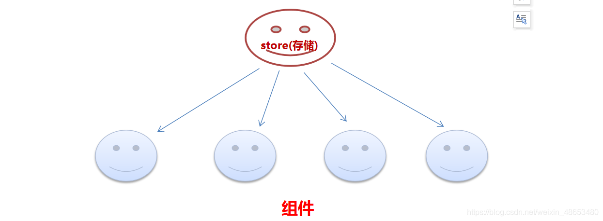
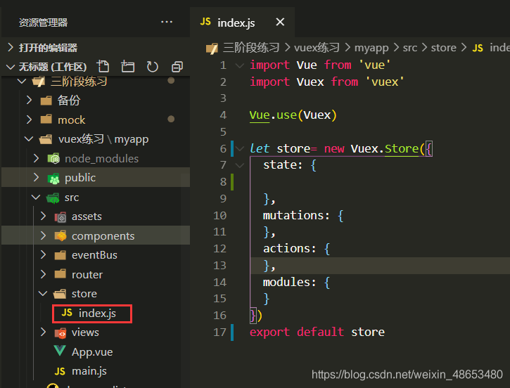
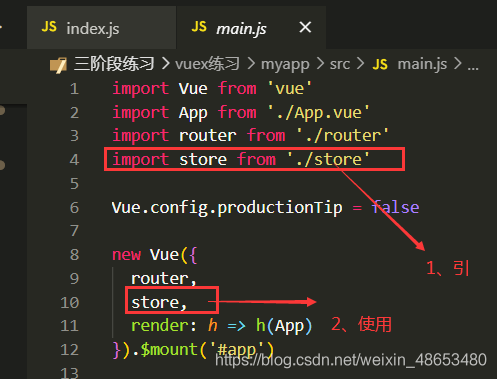
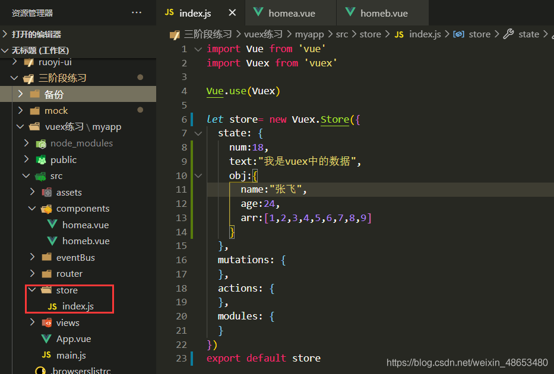
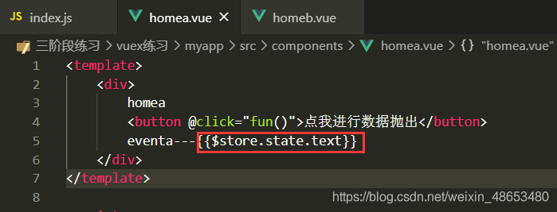
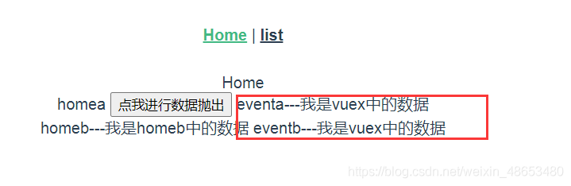
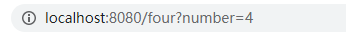
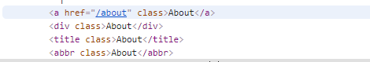
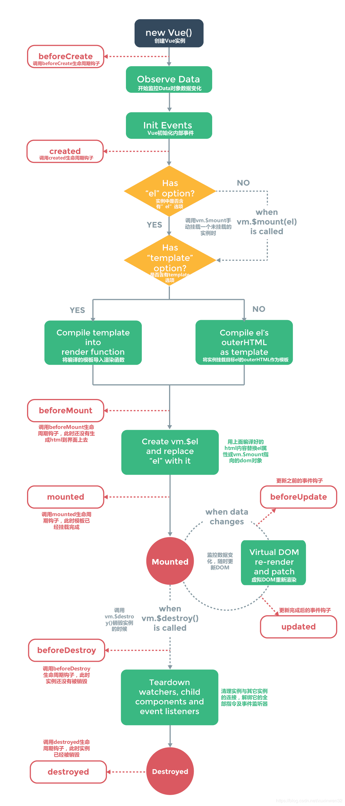
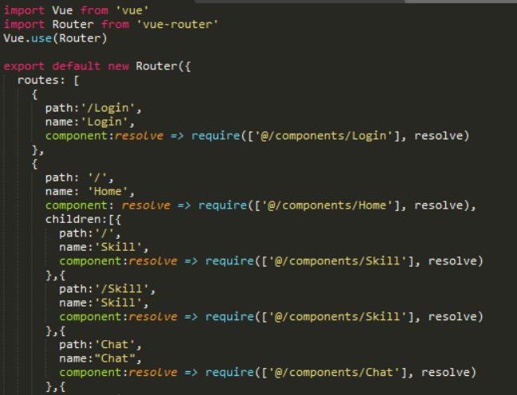

## **Vue相关的**

### 1.Vue的核心是什么

**数据驱动、组件系统**

**数据驱动:**ViewModel，保证数据和视图的一致性。

**组件系统:**应用类UI可以看作全部是由组件树构成的。

### 2.请简述你对vue的理解

**简单易学**:国人开发,中文文档,不存在语言障碍,易于理解和学习

**轻量级框架**:只关注视图层,是一个构建数据的视图集合,大小只有几十kb。Vue.js通过简洁的API提供高效的数据绑定和灵活的组件系统

**双向数据绑定**:vue.js通过MVVM思想实现数据的双向绑定，让开发者不用再操作dom对象，有更多的时间去思考业务逻辑。

**视图,数据,结构分离**:使数据的更改更为简单,不需要进行逻辑代码的修改,只需要操作数据就能完成相关操作

**虚拟DOM**:传统开发中，用JQuery或者原生的JavaScript DOM操作函数对DOM进行频繁操作的时候，浏览器要不停的渲染新的DOM树，导致页面看起来非常卡顿。

> 比如:一个ul标签下有很多个li标签，其中只有一个li标签有变化，这种情况下如果使用新的ul去替代旧的ul，会因为这些不必要的DOM操作而造成性能上的浪费。

虚拟DOM在Vue.js中主要做了两件事情：

- 提供与真实DOM节点所对应的**虚拟节点VNode**
- 将虚拟节点VNode和旧虚拟节点oldVNode进行对比，然后更新视图

### 3.请简述vue的单向数据流

**单向数据流:**父级`prop`的更新会向下流动到子组件中，每次父级组件发生更新时，子组件中所有的`prop`都将会刷新为最新的值

### 4.Vue常用的修饰符有哪些

**修饰符**是用于限定类型以及类型成员的声明的一种符号

vue中修饰符分为以下五种：

1. **表单修饰符**

   填写表单的时候用得最多的是input标签，指令用得最多的是`v-model`

   关于表单的修饰符有如下：

   - **lazy:**在我们填完信息，光标离开标签的时候，才会将值赋予给value，也就是在change事件之后再进行信息同步

     ```vue
     <input type="text" v-model.lazy="value">
     <p>{{value}}</p>
     ```

   - **trim:**自动过滤用户输入的首空格字符，而中间的空格不会过滤

     ```vue
     <input type="text" v-model.trim="value">
     ```

   - **number:**自动将用户的输入值转为数值类型，但如果这个值无法被parseFloat解析，则会返回原来的值

     ```vue
     <input v-model.number="age" type="number">
     ```

2. **事件修饰符**

   **事件修饰符**是对事件捕获以及目标进行了处理，有如下修饰符：

   - **stop:**阻止了事件冒泡，相当于调用了event.stopPropagation方法

     ```vue
     <div @click="shout(2)">
       <button @click.stop="shout(1)">ok</button>
     </div>
     //只输出1
     ```

   - **prevent:**阻止了事件的默认行为，相当于调用了event.preventDefault方法

     ```vue
     <form v-on:submit.prevent="onSubmit"></form>
     ```

   - **self:**只当在 event.target 是当前元素自身时触发处理函数

     ```
     <div v-on:click.self="doThat">...</div>
     ```

     > 使用修饰符时，顺序很重要；相应的代码会以同样的顺序产生。因此，用 v-on:click.prevent.self 会阻止所有的点击，而 v-on:click.self.prevent 只会阻止对元素自身的点击

   - **once:**绑定了事件以后只能触发一次，第二次就不会触发

     ```vue
     <button @click.once="shout(1)">ok</button>
     ```

   - **capture:**使事件触发从包含这个元素的顶层开始往下触发

     ```vue
     <div @click.capture="shout(1)">
         obj1
     <div @click.capture="shout(2)">
         obj2
     <div @click="shout(3)">
         obj3
     <div @click="shout(4)">
         obj4
     </div>
     </div>
     </div>
     </div>
     // 输出结构: 1 2 4 3 
     ```

   - **passive:**在移动端，当我们在监听元素滚动事件的时候，会一直触发onscroll事件会让我们的网页变卡，因此我们使用这个修饰符的时候，相当于给onscroll事件整了一个.lazy修饰符

     ```vue
     <!-- 滚动事件的默认行为 (即滚动行为) 将会立即触发 -->
     <!-- 而不会等待 `onScroll` 完成  -->
     <!-- 这其中包含 `event.preventDefault()` 的情况 -->
     <div v-on:scroll.passive="onScroll">...</div>
     ```

     > 不要把 .passive 和 .prevent 一起使用,因为 .prevent 将会被忽略，同时浏览器可能会向你展示一个警告。
     > passive 会告诉浏览器你不想阻止事件的默认行为

   - **native:**让组件变成像html内置标签那样监听根元素的原生事件，否则组件上使用 v-on 只会监听自定义事件

   ```vue
   <my-component v-on:click.native="doSomething"></my-component>
   ```

   > 使用.native修饰符来操作普通HTML标签是会令事件失效的

3. **鼠标按键修饰符**

   鼠标按钮修饰符针对的就是左键、右键、中键点击，有如下：

   - left 左键点击
   - right 右键点击
   - middle 中键点击

   ```vue
   <button @click.left="shout(1)">ok</button>
   <button @click.right="shout(1)">ok</button>
   <button @click.middle="shout(1)">ok</button>
   ```

4. **键值修饰符**

   键盘修饰符是用来修饰键盘事件（onkeyup，onkeydown）的，有如下：

   keyCode存在很多，但vue为我们提供了别名，分为以下两种：

   - 普通键（enter、tab、delete、space、esc、up…）
   - 系统修饰键（ctrl、alt、meta、shift…）

   ```vue
   // 只有按键为keyCode的时候才触发
   <input type="text" @keyup.keyCode="shout()">
   ```

   还可以通过以下方式自定义一些全局的键盘码别名

   ```vue
   Vue.config.keyCodes.f2 = 113
   ```

5. **v-bind修饰符**

v-bind修饰符主要是为属性进行操作，用来分别有如下：

**sync:**能对props进行一个双向绑定

```vue
//父组件
<comp :myMessage.sync="bar"></comp> 
//子组件
this.$emit('update:myMessage',params);
```

以上这种方法相当于以下的简写

```vue
//父亲组件
<comp :myMessage="bar" @update:myMessage="func"></comp>
func(e){
 this.bar = e;
}
//子组件js
func2(){
  this.$emit('update:myMessage',params);
}
```

使用sync需要注意以下两点：

- 使用sync的时候，子组件传递的事件名格式必须为update:value，其中value必须与子组件中props中声明的名称完全一致
- 注意带有 .sync 修饰符的 v-bind 不能和表达式一起使用
- 将 v-bind.sync 用在一个字面量的对象上，例如 v-bind.sync=”{ title: doc.title }”，是无法正常工作的

**props:**设置自定义标签属性，避免暴露数据，防止污染HTML结构

**camel:**将命名变为驼峰命名法，如将view-Box属性名转换为 viewBox

```vue
<svg :viewBox="viewBox"></svg>
```

==**应用场景**==

根据每一个修饰符的功能，我们可以得到以下修饰符的应用场景：

- .stop：阻止事件冒泡

- .native：绑定原生事件
- .once：事件只执行一次
- .self ：将事件绑定在自身身上，相当于阻止事件冒泡
- .prevent：阻止默认事件
- .caption：用于事件捕获
- .once：只触发一次
- . keyCode：监听特定键盘按下
- .right：右键

### 5.v-text与{{}}区别

`{{message}}`：将数据解析为纯文本，不能输出真正的html，在页面加载时显示{{}}，所以通常使用v-html和v-text代替，且花括号方式在以后可能被取消

`v-html="html"`：用于输出html，它与v-text区别在于v-text输出的是纯文本，浏览器不会对其再进行html解析，但v-html会将其当html标签解析后输出。

`v-text="text"`：将数据解析为纯文本，不能输出真正的html，与花括号的区别是在页面加载时不显示{{}}

### 6.v-on可以绑定多个方法吗

```vue
<input
     type="text"
     v-on="{
     input:onInput,
     focus:onFocus,
     blur:onBlur,
     }"
   />
//--------------------------------------
<input type="text" :value="name" @input="onInput" @focus="onFocus" @blur="onBlur" />
```

### 7.Vue循环的key作用

**答:**

当 Vue.js 用 v-for 正在更新已渲染过的元素列表时，它默认用“就地复用”策略。

如果数据项的顺序被改变，Vue 将不会移动 DOM 元素来匹配数据项的顺序， 而是简单复用此处每个元素，并且确保它在特定索引下显示已被渲染过的每个元素。

**key的作用**主要是为了高效的更新虚拟DOM。

> ​		`key` 的特殊属性主要用在 Vue 的虚拟 DOM 算法，在新旧 nodes 对比时辨识 VNodes。如果不使用 key，Vue 会使用一种最大限度减少动态元素并且尽可能的尝试修复/再利用相同类型元素的算法。使用 key，它会基于 key 的变化重新排列元素顺序，并且会移除 key 不存在的元素。
>
> ​		什么意思呢？就是说，key值的存在保证了唯一性，可以用于dom的重新渲染或是就地复用。
>
> ​		vue在执行时，会对节点进行检查，如果没有key值，那么，vue检查到这里有dom节点，则会对内容进行清空，并且赋予新值；如果有key值的存在，那么vue会对`oldnode`和`newnode`进行对比，发现两者key值是否相同，进行调换位置或是删除操作。

### 8.什么是计算属性

**可以理解为能够在里面写一些计算逻辑的属性。**
**作用:**

1. 使得数据处理结构清晰；
2. 依赖于数据，数据更新，处理结果自动更新；
3. 计算属性内部this指向vm实例；
4. 在template调用时，直接写计算属性名即可；
5. 常用的是getter方法，获取数据，也可以使用set方法改变数据；
6. 相较于methods，不管依赖的数据变不变，methods都会重新计算，但是依赖数据不变的时候computed从缓存中获取，不会重新计算。

> **PS:计算属性和方法**
> 值不是直接渲染到页面，也是通过计算之后再渲染到页面，可以使用计算属性computed
>
> 1. methods中的方法在模板中被调用，如果这个方法依赖data，data的值发生了变化，这个方法就会重新执行；计算属性也具备这个特性。保证data中数据与页面中显示的数据保持一致！
> 2. 计算属性计算出来的结果会被缓存起来，下次无需计算直接显示，而方法不是，每次调用都会重新执行。

### 9.Vue单页面的优缺点

**单页面应用（SPA）**

单页面应用（SPA），通俗一点说就是指只有一个主页面的应用，浏览器一开始要加载所有必须的 html, js, css。所有的页面内容都包含在这个所谓的主页面中。但在写的时候，还是会分开写（页面片段），然后在交互的时候由路由程序动态载入，单页面的页面跳转，仅刷新局部资源。多应用于pc端。

**多页面应用（MPA）**

多页面（MPA），就是指一个应用中有多个页面，页面跳转时是整页刷新。

**单页面的优点：**

- 用户体验好，快，内容的改变不需要重新加载整个页面，基于这一点spa对服务器压力较小。
- 前后端分离。
- 页面效果会比较炫酷（比如切换页面内容时的专场动画）。

**单页面缺点：**

- 不利于seo。
- 导航不可用，如果一定要导航需要自行实现前进、后退。（由于是单页面不能用浏览器的前进后退功能，所以需要自己建立堆栈管理）。
- 初次加载时耗时多。
- 页面复杂度提高很多。

### 10.Vuex是什么？怎么使用？在那种场景下使用

**vuex**是通过创建一个集中的数据存储，方便程序中的所有组件进行访问。

**总结**：Vuex就是状态管理工具，数据管理工具



**使用:**

**安装vuex**
npm install vuex --save
配置vuex文件创建在src中创建store文件夹与store.js

==在main.js引入store，注入==

**1、创建vuex实例**：（如下图vscod已经帮我们创建好了，下面只是稍微改动了一下）：
将vux赋值给一个变量并暴露出去

**vuex中的数据源state**，我们需要保存的数据就保存在这里。



**2、vuex–使用数据源**：
要使用首先在全局main.js引入vuex。


**2.1**
**vuex中的数据源state**，我们需要保存的数据就保存在这里。
将数据放在state中

在需要使用这些数据的文件中可以使用$store.state.xx调用数据

页面效果：


### 11.Vue中路由跳转方式（声明式/编程式）

**(1)使用 标签实现路由打开 (声明式导航)：**

router-link标签会自动渲染成a标签，该组件的属性有：

`to 、 tag、target、 active-class、exact-active-class、exact 、event 、 replace、 append`

1. to（必选参数）指定要跳转的路由路径：类型string/location

   ```vue
   <!--直接写对用的路由名-->
   <router-link to="/about">About</router-link>
   
   <!--可以写对象  根据path路径指定跳转-->
   <router-link :to="{path:'one'}">路由一</router-link>
   <!--可以写对象  根据路由命名指定跳转-->
   <router-link :to="{name:'Two'}">路由二</router-link>
   ```

   ```vue
   <!--路由携带查询参数 params方法-->
   <router-link :to="{name:'Three',params: {number: '3' }}">路由三</router-link>
   <!--使用path 带路由参数params，params 不生效-->
   <router-link :to="{path:'/three',params: {number: '3' }}">路由三</router-link>
   ```

   在被跳转到路由页面中获取传递参数

   ```vue
   created(){
   	//获取params传递的参数
   	console.log(this.$route.params.number)
   }
   ```

   ```vue
   <!--路由携带查询参数 query方法-->
   <!--query传参会 地址栏变成 /Four?number=4-->
   <router-link :to="{path:'Four',query: {number: '4' }}">路由四</router-link>
   <router-link :to="{name:'Four',query: {number: '4' }}">路由四</router-link>
   ```

   改变地址拼接传递参数

   

   在被跳转到路由页面中获取传递参数

   ```vue
   created(){
   	//获取query传递的参数
   	console.log(this.$route.query.number)
   }
   ```

2. tag：类型: string 可以指定当前标签渲染为其他某种标签,默认值: “a” ,

   ```vue
   <!--tag属性 会指定渲染标签-->
    <router-link to="/about">About</router-link>
   <router-link to="/about" tag='div'>About</router-link>
   <router-link to="/about" tag='title'>About</router-link>
   <router-link to="/about" tag='abbr'>About</router-link>
   ```

   这是前端渲染 默认为a标签

   

3. target 属性规定在何处打开链接文档 默认值_self:在相同的框架中打开被链接文档 _parent:在父框架集中打开被链接文档。 _top:在整个窗口中打开被链接文档。 _blank:在新窗口中打开被链接文档 (只有tag=“a"模式下 target=”_blank" 属性才会生效。)

4. active-class 类型: string 默认值: “router-link-active” 设置 链接激活时使用的 CSS 类名。默认值可以通过路由的构造选项 linkActiveClass 来全局配置。

5. exact-active-class 类型: string 默认值: “router-link-exact-active” 配置当链接被精确匹配的时候应该激活的 class。注意默认值也是可以通过路由构造函数选项 linkExactActiveClass 进行全局配置的

6. exact 类型: boolean 默认值: false按照这个规则，每个路由都会激活< router-link to="/" >！想要链接使用 “exact 匹配模式”，则使用 exact 属性

7. event 类型: string | Array< string > 默认值: ‘click’ 声明可以用来触发导航的事件。可以是一个字符串。

8. replace 类型: boolean 默认值: false 设置 replace 属性的话，当点击时，会调用 router.replace() 而不是 router.push()，于是导航后不会留下 history 记录。

9. append 类型: boolean 默认值: false 设置 append 属性后，则在当前 (相对) 路径前添加基路径

**(2)可以借助 router 的实例方法，通过编写代码来实现 (编程式导航)：**

在Vue实例内部，你可以通过`router`访问路由实例 。因 此你可以 调 用this.router访问路由实例。因此你可以调用this.router访问路由实例。因此你可以调用`this.router.push`。

想要导航到不同的URL，则使用`router.push`方法。这个方法会向history栈添加一个新的记录，所以，当用户点击浏览器后退按钮时，则回到之前的URL。

点击事件

```vue
<!--编程式导航-->
<div @click="goRouter">跳转路由</div>
```

methods下的函数

```js
methods:{
	goRouter(){
		// 字符串
		this.$router.push('four')
		
		// 对象
		this.$router.push({ path: 'four' })

		// 命名的路由
		this.$router.push({ name: 'Four', params: { number: '123' }})
		//如果提供了 path，params 会被忽略，上述例子中的 query 并不属于这种情况。取而代之的是下面例子的做法，你需要提供路由的 name 或手写完整的带有参数的 path：
		this.$router.push({ path: '/four', query: { number: '123' }})
		
		const number = '1234'
		this.$router.push({ path: `/four/${number}`})
		
		//this.$router.replace 使用方法同this.$router.push  但是history栈中不会有记录，点击返回会跳转到上上个页面

		//回退方法 这个方法的参数是一个整数，意思是在 history 记录中向前或者后退多少步，类似 window.history.go(n)。
		this.$router.go(1)
	}
}
```

有时候需要在编程式导航中在浏览器中打开一个新的页面窗口 使用 $router.resolve 这种方法能够实现新窗口打开，

```js
let routeData = this.$router.resolve({
	name: "Four",
	query:{number:'123456'}
});
window.open(routeData.href, '_blank');
```

### 12.跨域的解决方式


### 13.请简述Vue的生命周期以及作用

vue实例从开始创建、初始化数据，编译模板、挂载DOM 渲染、更新、卸载等一系列过程，称为Vue的生命周期，可以分为创建前后、载入前后、更新前后、销毁前后。

**可以理解vue生命周期就是指vue实例从创建到销毁的过程**

**创建前后：** **BeforeCreate** 、 **Created**

1、`beforeCreate`：这个阶段实例已经初始化，只是数据观察与事件机制尚未形成，不能获取DOM节点`（没有data，没有el）`
 `使用场景：因为此时data和methods都拿不到，所以通常在实例以外使用`
 2、`created`：实例已经创建，仍然不能获取DOM节点`（有data，没有el）`
 `使用场景：模板渲染成html前调用，此时可以获取data和methods，so 可以初始化某些属性值，然后再渲染成视图，异步操作可以放在这里`

**载入前后：** **BeforeMount 、Mounted**

1、`beforeMount`：是个过渡阶段，此时依然获取不到具体的DOM节点，但是vue挂载的根节点已经创建`（有data，有el）`
 2、`mounted`：数据和DOM都已经被渲染出来了
 `使用场景：模板渲染成html后调用，通常是初始化页面完成后再对数据和DOM做一些操作，需要操作DOM的方法可以放在这里`

**更新前后：** **BeforeUpdate** 、 **Update**

1、`beforeUpdate`：检测到数据更新时，但在DOM更新前执行
2、`updated`：更新结束后执行
`使用场景：需要对数据更新做统一处理的；如果需要区分不同的数据更新操作可以使用$nextTick`

**销毁前后：** **BeforeDestory** 、 **Destroyed**

1、`beforeDestroy`：当要销毁vue实例时，在销毁前执行
2、`destroyed`：销毁vue实例时执行

**第一次页面加载会触发哪些钩子**

`beforeCreate`、`created`、`beforeMount`、`mounted`



**作用:它的生命周期中有多个事件钩子，让我们在控制整个Vue实例的过程时更容易形成好的逻辑。**

### 14.DOM渲染在那个生命周期阶段内完成

DOM 渲染在 mounted 中就已经完成了。

### 15.Vue路由的实现

**vue-router是专为Vue打造的路由管理工具**

**1，hash模式**

默认模式，在浏览器中符号“#”，#以及#后面的字符称之为hash，用window.location.hash读取；

特点：hash虽然在URL中，但不被包括在HTTP请求中；用来指导浏览器动作，对服务端安全无用，hash不会重加载页面。

hash 模式下，仅 hash 符号之前的内容会被包含在请求中，如 http://www.xxx.com，因此对于后端来说，即使没有做到对路由的全覆盖，也不会返回 404 错误。

**2，history模式**

history采用HTML5的新特性；且提供了两个新方法：pushState()，replaceState()可以对浏览器历史记录栈进行修改，以及popState事件的监听到状态变更。

history 模式下，前端的 URL 必须和实际向后端发起请求的 URL 一致，如 http://www.xxx.com/items/id。后端如果缺少对 /items/id 的路由处理，将返回 404 错误。

**3，abstract模式**

支持javascript的所有运行环境，常指Node.js服务器环境

### 16.Vue路由模式***hash和history，简单讲一下***


### 17.Vue路由传参的两种方式，prams和query方式与区别

 

### 18.Vue数据绑定的几种方式

 一、绑定数据的三种方式

1：普通文本绑定，mustach语法【双大括号】 {{}} 或者 使用v-text 绑定【常用】

2：解释HTML标签的绑定：使用v-html绑定【慎用】

> 注意：除非是信任的内容使用这样的方式进行数据绑定    
> 这样的绑定方式，如果内容不是被信任的，有可能会造成XSS攻击 

3：将数据绑定到标签的属性上，使用 v-bind:属性名称=”变量” 来绑定【常用】

### 19.Vue注册一个全局组件

 

### 20.Vue的路由钩子函数/路由守卫有哪些

(1)**全局守卫**
router.beforeEach：全局前置守卫，进入路由之前

router.beforeResolve：全局解析守卫，在beforeRouteEnter调用之后调用

router.afterEach：全局后置钩子，进入路由之后
(2)**路由组件内的守卫**
beforeRouteEnter()：进入路由前

beforeRouteUpdate()：路由复用同一个组件时

beforeRouteLeave()：离开当前路由时

### 21.Vue中如何进行动态路由设置？有哪些方式？怎么获取传递过来的数据？

--可以通过query ,param两种方式
区别: query通过url传参，刷新页面还在    params刷新页面不在了
    params的类型:

配置路由格式:/router/:id
传递的方式:在path后面跟上对应的值
 传递后形成的路径:/router/123
<!-- 动态路由-params -->

//在APP.vue中
    <router-link :to="'/user/'+userId" replace>用户</router-link>    

//在index.js
     {
    path: '/user/:userid',
    component: User,
    },
跳转方法:

```js
// 方法1：
<router-link :to="{ name: 'users', params: { uname: wade }}">按钮</router-link>
// 方法2：
this.$router.push({name:'users',params:{uname:wade}})
// 方法3：
this.$router.push('/user/' + wade)
```

可以通过$route.params.userid 获取你说传递的值

   query的类类型

  配置路由格式:/router,也就是普通配置
  传递的方式:对象中使用query的key作为传递方式
  传递后形成的路径:/route?id=123

```js
<!--动态路由-query -->
//01-直接在router-link 标签上以对象的形式
<router-link :to="{path:'/profile',query:{name:'why',age:28,height:188}}">档案</router-link>
/*
```

​    02-或者写成按钮以点击事件形式

```js
  <button @click='profileClick'>我的</button>    
*/

 //点击事件
 profileClick(){
   this.$router.push({
        path: "/profile",
        query: {
          name: "kobi",
          age: "28",
          height: 198
        }
      });
 }
```

跳转方法:

```js
// 方法1：
<router-link :to="{ name: 'users', query: { uname: james }}">按钮</router-link>
// 方法2：
this.$router.push({ name: 'users', query:{ uname:james }})
// 方法3：
<router-link :to="{ path: '/user', query: { uname:james }}">按钮</router-link>
// 方法4：
this.$router.push({ path: '/user', query:{ uname:james }})
// 方法5：
this.$router.push('/user?uname=' + jsmes)
```

可以通过$route.query 获取你说传递的值

### 22.Elementui中的常用组件有哪些？请简述你经常使用的 并且他们的属性有哪些？

### 23.Vue-cli中如何自定义指令

1. 创建局部指令

   ```js
   var app = new Vue({
   el: '#app', data: {}, // 创建指令(可以多个)
   directives: {// 指令名称        
   	dir1: {
   		inserted(el) {
   		// 指令中第一个参数是当前使用指令的DOM
   		console.log(el);
   		console.log(arguments);//对DOM进行操作                
   	el.style.width = '200px';
       el.style.height = '200px';
   	el.style.background = '#000';
   				}
   			}
   		}
   	})
   ```

2. 全局指令

   ```js
   Vue.directive(
   'dir2', {    
   inserted(el) {        
   console.log(el);    
   }})
   ```

3. 指令的使用

```xml
<div id="app">    
    <div v-dir1></div>    
    <div v-dir2></div>
</div>
```

### 24.Vue中指令有哪些

### 25.Vue如何定义一个过滤器

**html代码:**

```html
<div id="app">     
    <input type="text" v-model="msg" />     	{{msg| capitalize }}
</div>
```

**JS代码:**

```js
var vm = new Vue({
		el: "#app",
		data: {
			msg: ''
		},
		filters: {
			capitalize: function (value) {
				if (!value) return ''
				value = value.toString()
				return value.charAt(0).toUpperCase() + value.slice(1)
			}
		}
	})
```

全局定义过滤器:

```js
Vue.filter('capitalize', function (value) {
		if (!value) return ''
		value = value.toString()
		return value.charAt(0).toUpperCase() + value.slice(1)
	})
```

过滤器接收表达式的值 (msg) 作为第一个参数。capitalize 过滤器将会收到 msg的值作为第一个参数。

### 26.对vue 中keep-alive的理解

keep-alive是 Vue 内置的一个组件，可以使被包含的组件保留状态，或避免重新渲染。
在vue 2.1.0 版本之后，keep-alive新加入了两个属性: include(包含的组件缓存) 与 exclude(排除的组件不缓存，优先级大于include) 。

```vue
<keep-alive include='include_components' exclude='exclude_components'>
    <component>    
        <!-- 该组件是否缓存取决于include和exclude属性 -->  
    </component>
</keep-alive>
```

**参数解释**
include - 字符串或正则表达式，只有名称匹配的组件会被缓存
exclude - 字符串或正则表达式，任何名称匹配的组件都不会被缓存
include 和 exclude 的属性允许组件有条件地缓存。二者都可以用“，”分隔字符串、正则表达式、数组。当使用正则或者是数组时，要记得使用v-bind 。

**使用示例**

```vue
<!-- 逗号分隔字符串，只有组件a与b被缓存。-->
<keep-alive include="a,b">
    <component></component>
</keep-alive>
<!-- 正则表达式 (需要使用 v-bind，符合匹配规则的都会被缓存) -->
<keep-alive :include="/a|b/">
    <component></component>
</keep-alive>
<!-- Array (需要使用 v-bind，被包含的都会被缓存) -->
<keep-alive :include="['a', 'b']">  <component></component>
</keep-alive>
```

### 27.如何让组件中的css在当前组件生效

在style标签中写入scoped即可 例如：`<style scoped></style>`

### 28.Vue生命周期一共几个阶段

四个,**初始化 (create)--- 组件挂载(mount)-----组件更新 (update)--- 销毁(destroy)**

### 29.Mvvm与mvc的区别

MVC和MVVM都是一种设计思想。

**MVC:**View是可以直接访问Model的。从而，View里会包含Model信息，不可避免的还要包括一些业务逻辑。。

**MVVM:**主要解决了MVC中大量的DOM操作使页面渲染性能降低，加载速度变慢，影响用户体验。

**区别就是**：MVVM实现了View和Model的自动同步，也就是当Model的属性改变时，我们不用再自己手动操作Dom元素，来改变View的显示，而是改变属性后该属性对应View层显示会自动改变。

### 30.Vue组件中的data为什么是函数

**Vue.js中data的作用**

**（1）Vue.js中data为什么是一个函数**

Vue组件具有高度复用性，组件是可复用的Vue实例，一个组件被创建后，可能被应用到各个地方，而不管这个组件被复用了多少次，组件中的data都应该是相互隔离，互不影响的，基于这一理念，组件每被复用一次，组件中的data就应该被复制一次，这样就可以保证，*当某一处被复用的组件中的data的值发生变化后，也不会影响到其它被复用组件中的data的值。*

**（2）Vue.js中data为什么要return回去**

不使用return包裹的数据会在项目的全局可见，会造成变量污染
*使用return包裹后的数据中的变量只是在当前组件内生效，不会影响其它组件*
其实相当于使用闭包的一个思想，将当前页面内的数据放在了一个闭包里面，形成一个封闭的空间。

### 31.Vue双向绑定的原理

通过数据劫持以及发布者-订阅者模式的方式来实现的，

关于VUE双向数据绑定，其核心是 `Object.defineProperty(obj,prop,descriptor)`方法；

> obj:目标对象
>
> prop:需要定义的属性或方法的名称
>
> descriptor:目标属性所拥有的特性

### 32.Vue中组件怎么传值

**(1)父--->子组件**

**1)方式一**

**父组件中**，子组件以自定义标签，或者`router-view`的形式调用，在这些标签里通过`:lists='list'`形式传递给子组件。:后面跟的是自己定义的参数名，后面子组件接收时用到。==' '==里面跟的是父组件里的数据，或者方法。

**子组件中**，用`props:['lists','alert1']`,形式接收父组件的数据和方法，注意接收使用的名字跟父组件自己定义的名字要一致，此时如果接收的方法用到了父组件的变量，在子组件中调用时，还是指向父组件的变量。

**2)方式二**

**父组件中**基本同上，区别在于绑定的时候用v-on:或@而不是用`:`   **亲测只有:不起作用**。

**子组件中**不使用props来接收父组件的方法，在methods中通过定义一个新方法，在方法体里面写`this.$emit('alert1','canshu1')`，以这种形式获取父组件的方法，在赋值给子组件新定义的方法，

注意alert1是父组件中绑定时候自己定义的名字，canshu1若该方法带参数则加上，不带则加空字符串即可。

**(2)子--->父组件**

1. 子组件定义好方法，
2. 父组件在引用子组件的时候在自定义标签中添加标识符，`ref='child1'`，用来表示这个子组件。
3. 父组件在methods中定义自己的方法名，方法主体：`this.$refs.child1.fun`。

> 意思是通过调用`$refs`中名字叫child1的子组件里的fun方法，赋值给父组件。

**(3)兄弟组件通信**

**1)方式一**

第一步：借助中央事件总线：在外部新建一个js文件，取名Bus.js，可放在assets文件夹目录下。

第二步：两个组件作为子组件被同一个父组件所引用，在同一个页面显示。

第三步：两个兄弟组件之间的语法

组件1需要定义一个发送数据的方法，此处sendMsg是定义在此的方法，页面点击时候触发此函数，函数主体，通过Bus中央事件总线用$emit发送一个send事件，事件的功能就是传送一个this.a++的数据，区分sendMsg和send，前者是当前页面的点击事件，后者是发送出去，需要其他组件监听的事件。
组件2在组件2事先定义一个变量，在生命周期为created的时候，通过Bus中央事件总线用$on监听组件1中发送的send事件，用一个带参数的回调函数，接收穿过来的值，参数即为传的值 ，把值赋值给当前组件的变量。

**2)方式二**（方式1的简化版）

第一步：省略了外部的js文件，直接把总线放在main.js里的vue实例中，写法如图。

第二步：在使用的时候，不需要引入外部文件，只需要在Bus前加this.$root，即可调用。

**(4)页面跳转传值**

方式1：query传值在router-link标签内to的后面直接加

怎么获取id值，

在全局已经存在这个变量，只需要按照图中所示，找到这个变量重新赋值即可。

注意：传值的时候会在url地址后面明码拼接所传的值，另外，在组件1中发送数据，到了组件2的url上才会拼接出来，所以，数据也只能在组件2中获取。

刷新不会清空

方式2：params传值：在router-link中加

跟query的传值在写法上很相似，url的显示则完全不同，注意params有一个name属性，对应的是你需要传过去的那个组件的name名在路由中有定义，必须一致。

路由书写


路由要定义好后面跟随的参数名


调用数据跟query类似，修改query为params。

### 33.Bootstrap的原理

通过定义容器大小，平分12份(也有平分成24份或32份，但12份是最常见的)，再调整内外边距，最后结合媒体查询，就制作出了强大的响应式网格系统。

Bootstrap框架中的网格系统就是将容器平分成12份。

### 34.Vue兄弟组件传值

通过一个事件总线来实现（可以把事件总线理解为一个全局变量），他是做完一个兄弟之间的桥梁，总线的名称是可以随便来起的，但通常有几个固定的名字是人们看到都认识能识别到的

思路：在Vue的原型上创建一个属性bus，该属性的值为new Vue（），即bus也是一个vue实例

第一步：在main.js中创建bus总线

第二步：在子组件A中，通过bus总线抛出信息和值。**this.bus就是Vue实例，$emit也是上面的方法**

第三步：在子组件B中，在created或mounted等生命周期函数上，监听那个事件和获取那个值。

注意：bus总线，是联动的，当A组件触动bus总线的时候，B组件中也会响应式的触发。

B组件中的bus，需要在函数中，比如：created函数、mounted函数、甚至是data函数。

data中：

### 35.如果一个组件在多个项目中使用怎么办


### 36.槽口请简述

**插槽**就是要将父组件中的内容渲染到子组件中。就好像是在子组件中留了一个空的位置（就像小霸王上的插卡口），然后把父组件中的内容插进去（你的游戏卡盘）。

> ​		A.vue把B.vue注册成为新的组件当做标签用，并在B标签中写了一些内容，然后在B.vue中用`<slot></slot>`把A.vue中B标签里的内容渲染出来。

插槽有==三种==：单个(普通)插槽、具名插槽、作用域插槽。

**槽口的作用 :**
在组件里插入内容,用来混合父组件的内容与子组件自己的模板

**普通槽口:**
`<slot></slot>`,1个组件只有1个

**具名槽口:**
带name属性的槽口,`<slot name='slotA'></slot>`1个组件可以有多个,具名槽口将绑定slot属性等于其name的标签

**作用域插槽:**

是为了从父组件中，通过使用注册的子组件标签，并对其属性`slot-scope`进行定义，从而使用子组件中绑定的数据。

**槽口的显示**
槽口的显示是按照其组件顺序来显示的

### 37.Watch请简述

**watch**主要是用来监听数据变化，通过新数据和旧数据相比较，实时监听数据的变化,也可以监听路由的变化，来执行方法

> 一个对象，键是需要观察的表达式，值是对应回调函数。值也可以是方法名，或者包含选项的对象。Vue 实例将会在实例化时调用 $watch()，遍历 watch 对象的每一个属性。

```js
data(){
    return{
        pageNo: 1,
    }
}
watch:{
     pageNo: function(oldVal, newVal) {
        //之前的数据
        console.log("oldVal");
        //变化之后的数据
        console.log("newVal");    
        if(oldVal !=newVal){
            //执行的
        }
    }
}
```

### 38.Vant ui请简述下


### 39.计算属性与watch区别

1. **computed**计算属性是依赖的值改变会重新执行函数，计算属性是取返回值作为最新结果，所以里面不能异步的返回结果。不能写异步逻辑。具有缓存能力，所以只有当数据再次改变时才会重新渲染，否则就会直接拿取缓存中的数据。
2. **watch**侦听属性是侦听的值改变会重新执行函数，将一个值重新赋值作为最新结果，所以赋值的时候可以进行一些异步操作。

| **计算属性（computed）**                     | **属性检测（watch）**          |
| -------------------------------------------- | ------------------------------ |
| 首次运行                                     | 首次不运行                     |
| 调用时需要在模板中渲染，修改计算所依赖元数据 | 调用时只需修改元数据           |
| 默认深度依赖                                 | 默认浅度观测                   |
| 适合做筛选，不可异步                         | 适合做执行异步或开销较大的操作 |

### 40.mvvm框架是什么？它和其它框架（jquery）的区别是什么？哪些场景适合？

**(1)mvvm框架是什么？**
MVVM是Model-View-ViewModel的简写
Model：模型
View：视图
ViewModel：视图模型，连接view和model的桥梁
通常要实现一个observer观察者，当数据发生变化，ViewModel能够监听到数据的这种变化，然后通知到对应的视图做自动更新，而当用户操作视图，ViewModel 也能监听到视图的变化，然后通知数据做改动，这实际上就实现了数据的双向绑定。

**(2)它和其它框架（jquery）的区别是什么？**

vue数据驱动，通过数据来显示视图层而不是节点操作。

> **vue：**前端js库，是一个精简的MVVM，它专注于MVVM模型的viewModel层，通过双向数据绑定把view和model层连接起来，通过对数据的操作就可以完成对页面视图的渲染；
> **jquery：**轻量级的js库，在操作思想上： vue是使用数据驱动的方式，通过vue对象将数据和view完全分离开，对数据操 作，不在引用相应的DOM对象，通过vue对象，将数据和相应的DOM对象相互绑定起 来；主要是操作数据基于一种MVVM模式，jQuery是使用选择器（$）选取DOM对象，并对其进行赋值、取值、事件绑定等 操作，主要是操作DOM

**(3)哪些场景适合？**

数据操作比较多的场景，更加便捷

**应用场景的区别：** 

- vue适用的场景：复杂数据操作的后台页面，表单填写页面；
- jquery适用的场景：比如说一些html5的动画页面，一些需要js来操作页面样式的页面。

> 二者也是可以结合起来一起使用的，vue侧重数据绑定，jquery侧重样式操作， 动画效果等，则会更加高效率的完成业务

### 41.Vue首屏加载慢的原因，怎么解决的，白屏时间怎么检测，怎么解决白屏问题

**主要原因**是页面在打包后如果不进行相关配置会导致资源文件特别的大，一次想要全部加载完成会特别的耗时。

解决:

**1.使用CDN减小代码体积加快请求速度**

**2.开启gzip压缩**

**3.路由懒加载**

**4.图片放在oss上，不放在项目的assets文件夹下**

**5.去除ScourpMap文件**

**6.压缩代码，移除console.log**

检测：可视化检测   略

### 42.Vue双数据绑定过程中，这边儿数据改变了怎么通知另一边改变

实现mvvm的双向绑定，是采用==数据劫持结合发布者-订阅者模式==的方式，通过Object.defineProperty()来劫持各个属性的setter，getter，在数据变动时发布消息给订阅者，触发相应的监听回调。就必须要实现以下几点：

1. 实现一个数据监听器Observer，能够对数据对象的所有属性进行监听，如有变动可拿到最新值并通知订阅者
2. 实现一个指令解析器Compile，对每个元素节点的指令进行扫描和解析，根据指令模板替换数据，以及绑定相应的更新函数
3. 实现一个Watcher，作为连接Observer和Compile的桥梁，能够订阅并收到每个属性变动的通知，执行指令绑定的相应回调函数，从而更新视图

### 43.Vuex流程

**Vuex:**公共状态管理；解决多个非父子组件传值麻烦的问题；简单说就是多个页面都能用Vuex中store公共的数据

​		页面通过mapAction异步提交事件到action。action通过commit把对应参数同步提交到mutation。mutation会修改state中对应的值。
​		最后通过getter把对应值抛出去，在页面的计算属性中，通过mapGetter来动态获取state中的值

> 1. 通过new Vuex.Store()创建一个仓库 state是公共的状态，state--->components渲染页面
> 2. 在组件内部通过this.$store.state.属性 来调用公共状态中的state，进行页面的渲染。
> 3. 当组件需要修改数据的时候，必须遵循单向数据流。通过this.$store.dispatch来触发actions中的方法
> 4. actions中的每个方法都会接受一个对象 这个对象里面有一个commit方法，用来触发mutations里面的方法
> 5. mutations里面的方法用来修改state中的数据 mutations里面的方法都会接收到2个参数 一个是store中的state,另外一个是需要传递到参数
> 6. 当mutations中的方法执行完毕后state会发生改变，因为vuex的数据是响应式的 所以组件的状态也会发生改变

### 44.Vuex怎么请求异步数据

**store.js代码如下:**

```js
import Vue from 'vue'
import Vuex from 'vuex'
import axios from 'axios'
Vue.use(Vuex)
export default new Vuex.Store({
	//状态数据
	state: {
		list:['默认为空']
	},
	//getters可以认为是store的计算属性
	getters: {
		list(state) {
			return state.list
		}
	},
	//存放同步函数方法
	mutations: {
		updateState(state,payload){
			state.list = payload
		},
		setState(state,payload){
			state.list = payload
		}
	},
	//存放异步函数方法
	actions: {
		//async异步
		async getTodos({commit}) {
			const result = await axios.get('http://jsonplaceholder.typicode.com/todos?_limit=10');
			commit('updateState', result.data);
		},
		//Promise异步
		fetchTodos({commit}, params) {
			return new Promise((resolve, reject) => {
				fetch('http://jsonplaceholder.typicode.com/todos?_limit=5')
					.then(res => res.json())
					.then(data => {
						commit('setState', data)
						reject(data)
					})
					.catch(err => reject(err));	//抛出错误回调
			});
		}
		
	}
})
```

```
<template>
  <div id="app">
		<!-- 匹配到的路由组件 -->
		<!-- <router-view /> -->
		<h1>下面是store内异步获取的数据</h1>
		<h2>{{list}}</h2>
		<h1> 
			<input type="button" value="同步方法改变数据1" @click="updateState(11111)">
			<input type="button" value="同步方法改变数据2" @click="setState(2222222)">
			<input type="button" value="异步方法获取数据1" @click="getTodos()">
			<input type="button" value="异步方法获取数据2" @click="fetchTodos()">
		</h1>
  </div>
</template>

<script>
//导入vuex辅助函数
import {mapState,mapGetters,mapMutations,mapActions} from 'vuex'
export default {
  name: 'app',
	//这里面存放数据
	data(){
		return{
		}
	},
	//获取计算数据
	computed: mapGetters(['list']),
	methods:{
		//获取store内同步方法
		...mapMutations(['updateState','setState']),
		//获取store内异步方法
		...mapActions(['getTodos','fetchTodos'])
	},
}
</script>

<style>
#app {
  font-family: 'Avenir', Helvetica, Arial, sans-serif;
  -webkit-font-smoothing: antialiased;
  -moz-osx-font-smoothing: grayscale;
  text-align: center;
  color: #2c3e50;
  margin-top: 60px;
}
</style>
————————————————
版权声明：本文为CSDN博主「舜岳」的原创文章，遵循CC 4.0 BY-SA版权协议，转载请附上原文出处链接及本声明。
原文链接：https://blog.csdn.net/qq_41614928/article/details/100051104
```

**组件App.vue代码如下:**

```js
<template>
  <div id="app">
		<!-- 匹配到的路由组件 -->
		<!-- <router-view /> -->
		<h1>下面是store内异步获取的数据</h1>
		<h2>{{list}}</h2>
		<h1> 
			<input type="button" value="同步方法改变数据1" @click="updateState(11111)">
			<input type="button" value="同步方法改变数据2" @click="setState(2222222)">
			<input type="button" value="异步方法获取数据1" @click="getTodos()">
			<input type="button" value="异步方法获取数据2" @click="fetchTodos()">
		</h1>
  </div>
</template>

<script>
//导入vuex辅助函数
import {mapState,mapGetters,mapMutations,mapActions} from 'vuex'
export default {
  name: 'app',
	//这里面存放数据
	data(){
		return{
		}
	},
	//获取计算数据
	computed: mapGetters(['list']),
	methods:{
		//获取store内同步方法
		...mapMutations(['updateState','setState']),
		//获取store内异步方法
		...mapActions(['getTodos','fetchTodos'])
	},
}
</script>

<style>
#app {
  font-family: 'Avenir', Helvetica, Arial, sans-serif;
  -webkit-font-smoothing: antialiased;
  -moz-osx-font-smoothing: grayscale;
  text-align: center;
  color: #2c3e50;
  margin-top: 60px;
}
</style>
```

### 45.Vuex中action如何提交给mutation的

action异步请求数据，然后把数据通过调用mutation的方法去改变state里的数据

### 46.Route与router区别

**(1)router**

是VueRouter的一个对象，通过Vue.use(VueRouter)和VueRouter构造函数得到一个router的实例对象，这个对象中是一个全局的对象，他包含了所有的路由包含了许多关键的对象和属性。

> 举例：history对象
>
> `$router.push({path:'home'});`本质是向history栈中添加一个路由，在我们看来是 切换路由，但本质是在添加一个history记录
>
> 方法：
>
> `$router.replace({path:'home'});`//替换路由，没有历史记录

**(2)route**

是一个跳转的路由对象，每一个路由都会有一个route对象，是一个局部的对象，可以获取对应的name,path,params,query等

> `$route.path` 
> 字符串，等于当前路由对象的路径，会被解析为绝对路径，如 `"/home/news"` 。
>
> `$route.params` 
> 对象，包含路由中的动态片段和全匹配片段的键值对
>
> `$route.query` 
> 对象，包含路由中查询参数的键值对。例如，对于 `/home/news/detail/01?favorite=yes` ，会得到`$route.query.favorite == 'yes'` 。
>
> `$route.router` 
> 路由规则所属的路由器（以及其所属的组件）。
>
> `$route.matched` 
> 数组，包含当前匹配的路径中所包含的所有片段所对应的配置参数对象。
>
> `$route.name` 
> 当前路径的名字，如果没有使用具名路径，则名字为空。
>
> `$route.path, $route.params, $route.name, $route.query`这几个属性很容易理解，主要用于接收路由传递的参数

### 47.vuex有哪几种状态和属性

有五种,分别是`State` , `Getter` , `Mutation` , `Action` , `Module` (就是mapAction)

### 48.vuex的State特性是？

state就是存放数据的地方，类似一个仓库 , 特性就是当mutation修改了state的数据的时候，他会动态的去修改所有的调用这个变量的所有组件里面的值（ 若是store中的数据发生改变，依赖这个数据的组件也会发生更新 ）

### 49.vuex的Getter特性是？

类似`vue`的计算属性，主要用来过滤一些数据。

> `mapgetter`经常在计算属性中被使用

### 50.vuex的Mutation特性是？

同步执行。修改state数据的唯一途径。直接变更state状态。

> 也就是说，在`mutation`中写上自定义的方法，然后在组件的js中通过`this.$store.commit("自定义的方法名")`就可以更新`store`中的数据和状态

> Action 类似于 mutation，不同在于：
>
> - Action 提交的是 mutation，而不是直接变更状态。
> - Action 可以包含任意异步操作

### 51.vuex的actions特性是？

是用来处理异步方法的，通过**提交mutations实现**state数据的修改。

> actions里要传入两个参数`context`和`playload`
>
> 调用actions的时候，使用`this.$store.dispatch("actionsName",playload)`
>
> view 层通过`store.dispath`来分发 action

### 52.vuex 是什么？怎么使用？哪种功能场景使用它

**vuex**是vue框架中状态管理。

**使用:**在main.js引入store，注入。新建了一个目录store，...export。

> 用来读取的状态集中放在`store`中； 改变状态的方式是提交`mutations`，这是个同步的事物； 异步逻辑应该封装在`action`中。

**应用场景:**单页应用中，组件之间的状态(比如,音乐播放、登录状态、加入购物车等等)。

### 53.vuex的优势

状态管理工具 核心是响应式的做到数据管理, 一个页面发生数据变化。动态的改变对应的页面

兄弟之间组件有大量通信的，建议一定要用VUEX，不管大项目和小项目

### 54.Vue路由懒加载（按需加载路由）

**1 . vue异步组件技术 ==== 异步加载** 

>  vue-router配置路由 , 使用vue的异步组件技术 , 可以实现按需加载 . 
> 但是,这种情况下一个组件生成一个js文件

```js
/* vue异步组件技术 */
{ path: '/home',
  name: 'home',
  component: resolve => require(['@/components/home'],resolve) },
```



**2.组件懒加载方案二 路由懒加载(使用import)**

```js
const 组件名=() => import('组件路径');

// 下面2行代码，没有指定webpackChunkName，每个组件打包成一个js文件。

/* const Home = () => import('@/components/home')

const Index = () => import('@/components/index')

const About = () => import('@/components/about') */

// 下面2行代码，指定了相同的webpackChunkName，会合并打包成一个js文件。把组件按组分块

const Home = () => import(/* webpackChunkName: 'ImportFuncDemo' */ '@/components/home')

const Index = () => import(/* webpackChunkName: 'ImportFuncDemo' */ '@/components/index')

const About = () => import(/* webpackChunkName: 'ImportFuncDemo' */ '@/components/about')

{ path: '/about', component: About }, { path: '/index', component: Index }, { path: '/home', component: Home }
```

**3.webpack提供的require.ensure()** 

> vue-router配置路由，使用webpack的require.ensure技术，也可以实现按需加载。
> 这种情况下，多个路由指定相同的chunkName，会合并打包成一个js文件。

```js
/* 组件懒加载方案三: webpack提供的require.ensure() */
{
  path: '/home',
  name: 'home',
  component: r => require.ensure([], () => r(require('@/components/home')), 'demo')
}, {
  path: '/index',
  name: 'Index',
  component: r => require.ensure([], () => r(require('@/components/index')), 'demo')
}, {
  path: '/about',
  name: 'about',
  component: r => require.ensure([], () => r(require('@/components/about')), 'demo-01')
}
```

### 55.v-for与v-if优先级

> **永远不要把 `v-if` 和 `v-for` 同时用在同一个元素上。**

1. v-for优先于v-if被解析。
2. 如果同时出现，每次渲染都会先执行循环再判断条件，无论如何循环都不可避免，浪费了性能。
3. 要避免上面出现的这种情况，则在外层嵌套template，在这一层进行v-if判断，然后在内部进行v-for循环。
4. 如果条件出现在循环内部，可通过计算属性提前过滤掉那些不需要显示的项。


 